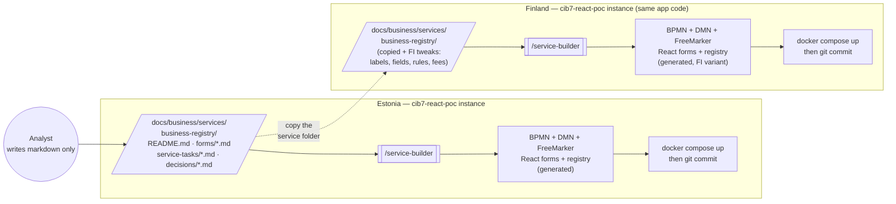

# CIB seven 2.1 + React — Human Tasks POC

A proof of concept: a [CIB seven](https://cibseven.org) 2.1 process engine runs
a BPMN process with **two human tasks**, a **DMN auto-approval decision**, a
**non-interrupting timer boundary event**, and **five connector-backed
service tasks** (one fetches a product price, one renders an approval PDF
via [Gotenberg](https://gotenberg.dev/), three POST email notifications —
one with the PDF attached — to [Mailpit](https://mailpit.axllent.org/)). A
**React** app opens each human task with its own hand-written form; the
**Cockpit / Tasklist / Admin** webapps are also bundled with full Keycloak
SSO.

It is a slice of the larger design in
[`docs/human-role-react-forms-spec.md`](docs/human-role-react-forms-spec.md) —
see [Deviations from the spec](#deviations-from-the-spec) below.

## Test logins & consoles

| Console | URL | Login | Password |
|---|---|---|---|
| **React SPA** (PartA & PartB) | <http://localhost:3000> | `bart` / `homer` | same as username |
| &nbsp;&nbsp;↳ PartA — applicant | | `bart` | `bart` |
| &nbsp;&nbsp;↳ PartB — civil servant | | `homer` | `homer` |
| **CIB seven Admin** (users, groups, authorizations) | <http://localhost:3000/camunda/app/admin/> | `admin` | `admin` |
| **CIB seven Cockpit** (process instances, incidents) | <http://localhost:3000/camunda/app/cockpit/> | `admin` | `admin` |
| **CIB seven Tasklist** (legacy task UI) | <http://localhost:3000/camunda/app/tasklist/> | `admin` | `admin` |
| **CIB seven REST API** | <http://localhost:3000/engine-rest> | Bearer JWT from Keycloak | — |
| **Mailpit inbox** (process-sent emails) | <http://localhost:8025> (needs `docker compose --profile dev up -d mailpit-ui`) | — | — |
| **Keycloak admin console** (realm / users / clients) | <http://localhost:8180/admin/> | `admin` | `admin` |
| **Traefik dashboard** (inspect ingress routes) | <http://localhost:8081/dashboard/> | — | — |
| **MCP endpoint** (Claude Desktop, Cursor, Codex, …) | <http://localhost:3000/mcp> | OAuth2 PKCE via Keycloak | (browser pops, log in as `bart` / `homer`) |
| &nbsp;&nbsp;↳ OAuth resource metadata | <http://localhost:3000/.well-known/oauth-protected-resource> | — | — |

Everything except Keycloak comes in through a single Traefik ingress on port
3000. The engine container's 8080, the MCP container's 8090, the frontend's
80, and Mailpit's 8025/1025 are no longer published to the host — they are
reachable only via the path-routed front door (or, for Mailpit's web UI,
the opt-in `dev` profile). Keycloak stays on its own port to avoid moving
the issuer URL stamped into existing JWTs.

Role notes:

- **`bart`** (Bart Simpson) — `/applicant` group, sees PartA on the SPA.
- **`homer`** (Homer Simpson) — `/civil-servant` group, sees PartB on the SPA.
  Cannot access `/camunda` webapps (those need `/cib7-admin`).
- **`admin`** — `/cib7-admin` group only, dedicated Camunda administrator.
  Admin everything on the `/camunda` webapps; not used in the SPA UI flows.
- Engine authorizations for `/applicant` and `/civil-servant` are bootstrapped
  on startup by `cib7/src/main/java/com/poc/cib7/AuthorizationBootstrap.java`;
  `/cib7-admin` is handled by the cibseven-keycloak plugin's
  `administratorGroupName` setting (full admin powers).
- Both webapp and SPA logins go through **Keycloak SSO** against the
  `cib7-poc` realm; the underlying user store is
  [`keycloak/realm-export.json`](keycloak/realm-export.json).

The SPA picks the role-appropriate UI from the JWT's realm roles:

- **PartA — applicant:** Services + My processes. Bart starts a process, fills
  the applicant form, and watches the status. If a civil servant sends the
  case back, the row's status shows "Sent back for corrections" and Bart can
  reopen the form (with the send-back reason shown as a banner) and resubmit.
- **PartB — back office:** Tasks + Incidents. Homer reviews the submitted
  application, then **Accept** (process ends approved) or **Send back…**
  (writes a reason variable and loops back to the applicant task).

Full realm in `keycloak/realm-export.json`.

---

## What it does

```
Person Registration (BPMN + DMN)

  start (initiator = applicant)
    │
    ▼  Submit personal details   user task   (applicant — PartA)
    │    first / last name, age, and a product picked from api.restful-api.dev
    │    assignee = ${initiator}
    │  ◀──────────────────────────────────────────────────────────────────┐
    ▼  Get price                 service task (http-connector)            │
    │    GET api.restful-api.dev/objects/{id} → data.price → price        │
    │                                                                     │
    ▼  Auto approval?            business rule task (DMN)                 │
    │    age + price → autoDecision ("approve" / "review")                │
    │                                                                     │
    ▼  Auto-approve? ── exclusive gateway ───▶ end approved   (skips PartB)
    │      else                                                           │
    ▼  Review application        user task   (civil servant — PartB)      │
    │    ⏱  PT2M non-interrupting timer ─▶  Send reminder email (Mailpit) │
    │    Accept → end approved                                            │
    │    Send back ─▶ Send "sent back" email (Mailpit) ───────────────────┘
    │                                                with reason
    ▼  Decision?  ── exclusive gateway ──▶  end approved
```

1. **Submit personal details** (applicant) — a React form collects first name,
   last name, age, and a product chosen from `api.restful-api.dev`. The task
   is assigned to the starting user via `camunda:assignee="${initiator}"`, so
   only that applicant sees it.
2. **Get price** — a service task using the
   [`http-connector`](#service-task--the-http-connector)
   calls `GET https://api.restful-api.dev/objects/{objectId}` and reads
   `data.price` from the JSON response into the `price` variable via Spin.
3. **Auto approval?** — a business rule task evaluates the
   [`auto-approval.dmn`](#dmn-decision-table) decision table (hit policy
   FIRST) on `age` and `price` and writes the result into `autoDecision`.
   Adults (age ≥ 18) picking cheap products (price &lt; 100) skip the human
   review; minors and expensive picks fall through.
4. **Review application** (civil servant) — a React form shows the submitted
   data and the fetched `price` read-only, and lets the reviewer **Accept**
   (sets `decision="approve"`) or **Send back** (sets `decision="sendback"`
   plus a `sendBackReason` variable). A **non-interrupting timer boundary
   event** fires every `PT2M` and triggers a [reminder email](#mailpit)
   without closing the task.
5. An exclusive gateway branches on `decision`. `approve` ends the process;
   any other value runs a **Send "sent back" email** service task (also via
   `http-connector` → Mailpit) and then loops back to the applicant task so
   they can fix the data based on the reason and resubmit.

## Spec-first services — portable across instances

A business service is defined **once** as a markdown spec under
`docs/business/services/<service>/`. Everything else — BPMN, DMN, React
forms, FreeMarker payloads, the form registry — is generated from it by the
[`/service-builder`](.claude/skills/service-builder/SKILL.md) skill. The
markdown folder is the portable unit: copy it into another instance of this
app, tweak the country-specific bits, regenerate, and you have the same
service localized.



- **Portable:** the markdown spec folder. One analyst-authored artifact
  describes the service end-to-end (flow, forms, integrations, decisions,
  roles, variables).
- **Per-instance:** the generated BPMN / React / DMN / FreeMarker
  (re-derived on each side by `/service-builder`) and the deployment
  (Docker, Keycloak realm, env vars).
- **Localization** lives in the spec, not in code. The FI variant edits the
  same markdown files — different field labels, different DMN rules
  (e.g. local fee thresholds), different email copy — and runs the builder
  again. The app code stays untouched.

For the step-by-step workflow — what each markdown file must define, how to
run the builder, how to test — see
[Add or modify a service](#add-or-modify-a-service).

## Architecture

```
  React SPA ──OIDC PKCE──▶ Keycloak ◀──Admin REST── CIB seven backend
   │   (keycloak-js)         │ ▲                    (identity provider plugin)
   │                         │ │ OAuth2 code flow
   │   Bearer JWT            │ │ (cib7-webapps client)
   ▼                         │ │
  /engine-rest               │ ▼
  /camunda/*  ─────▶  CIB seven 2.1 engine + REST + Cockpit/Tasklist/Admin
  (nginx / Vite proxy)  (Spring Boot, embedded engine, in-memory H2)
                                │
                                ├──▶  http-connector → api.restful-api.dev
                                │                       (product catalogue)
                                ├──▶  http-connector → Mailpit  (notifications
                                │                       + PDF attachments)
                                │                       :8025 (UI), :1025 (SMTP)
                                └──▶  http-connector → pdf-renderer → Gotenberg
                                                       (HTML → PDF, internal)
```

- The browser logs in against **Keycloak** (OIDC, PKCE) and then calls the
  same-origin path `/engine-rest/...` with a Bearer JWT on every request. In
  Docker, **nginx** proxies it to the backend; in dev, the **Vite** dev server
  does. No CORS configuration needed.
- The backend validates JWTs (Spring Security OAuth2 Resource Server) and the
  **CIB seven Keycloak Identity Provider Plugin** (`cibseven-keycloak` 2.1.0)
  reads users and groups from Keycloak's Admin REST API. Engine authorization
  is on, so `candidateGroups` on user tasks is enforced.
- The BPMN file lives in the backend and is **auto-deployed on startup**.
- The **Get price** service task calls the external API server-side, from the
  engine — via the official `http-connector`. The **Send reminder email**,
  **Send approval email**, and **Send "sent back" email** service tasks
  reuse the same `http-connector` against Mailpit's `/api/v1/send` JSON
  endpoint. The **Generate approval PDF** task uses the same connector
  against a tiny Node sidecar (`pdf-renderer/`) that fronts Gotenberg; the
  resulting PDF rides along as an attachment on the approval email.
- The **CIB seven webapps** (Cockpit / Tasklist / Admin) live under
  `/camunda/*` on the engine. A second `SecurityFilterChain` drives the
  Spring Security OAuth2 Authorization Code flow against the
  `cib7-webapps` Keycloak client and bridges the OIDC user into the
  engine's `IdentityService` via the cibseven-keycloak plugin's
  `ContainerBasedAuthenticationProvider` recipe.
- The database is **in-memory H2** — all data is lost when the backend stops.

## Talk to it from Claude Desktop (or any MCP client)

The same deployment is also reachable as an **MCP server** at
`/mcp`, so an MCP-capable AI assistant (Claude Desktop, Cursor, Codex,
Windsurf, claude.ai web Custom Connectors, …) can drive the deployment
in natural language. The sidecar serving this is at [`mcp/`](mcp/) —
see [`docs/mcp.md`](docs/mcp.md) for the full module guide.

**One-time setup** (per AI client).

Clients that speak the URL form natively (claude.ai web Custom
Connectors, Cursor with `connect_url`, etc.) just need
`http://localhost:3000/mcp` in their connector settings. Claude Desktop
on Windows currently doesn't — it rejects the `{"url":...}` config — so
go through the stdio bridge:

```bash
npm install -g mcp-remote
```

Then in `%APPDATA%\Claude\claude_desktop_config.json`:

```json
{
  "mcpServers": {
    "cib7": {
      "command": "node",
      "args": [
        "C:\\Users\\<you>\\git\\cib7-react-poc\\mcp\\cib7-bridge.mjs"
      ]
    }
  }
}
```

Fully quit Claude Desktop (tray → Quit) and reopen. The first MCP call
pops a browser to Keycloak — log in as a seeded user (`bart` / `bart`
applicant, `homer` / `homer` civil-servant) **or click "Register"** to
create your own account (verification email lands at Mailpit). The
client now has a valid Bearer and remembers it for the session.

**What you can do, end-to-end.** Eleven MCP tools cover the applicant
round trip, civil-servant review, and onboarding without anyone opening
the React SPA:

**Process tools** (forward the caller's Bearer to `/engine-rest`):

| Tool | Purpose |
|---|---|
| `list_services` | "What can I do here?" — enumerates `personRegistration` and `businessRegistration`. |
| `describe_service(key)` | Returns the per-service variable schema + LLM training markdown. |
| `start_process(key, variables)` | Validates variables with Ajv, starts a real BPMN instance. |
| `list_my_tasks` | Tasks waiting on the current user (assigned OR claimable via candidate group). |
| `get_form_schema(taskId)` | Schema for a specific task's form. |
| `complete_task(taskId, variables)` | Validates against the task schema, auto-claims if needed, completes. |
| `list_my_processes` | Newest-first list of instances started by the current user, with state. |
| `query_user_history(variableName)` | Most recent value the user has ever entered — the autofill primitive. |

**Identity tools** (Keycloak; never handle a password):

| Tool | Purpose |
|---|---|
| `get_signup_url` | Returns the hosted Keycloak sign-up URL + steps. Pure URL lookup. |
| `get_password_reset_url` | Returns the hosted Keycloak password-reset URL + steps. Pure URL lookup. |
| `send_account_invitation(username, email, firstName, lastName)` | Creates an invite-pending Keycloak user and emails them a magic link. The invitee sets their own password in Keycloak's form. |

A canonical session as `bart`:

> *"What services are available on the cib7 server?"* → `list_services`
> *"Register a company called Acme — board members Alice Aaver*
> *38501234567 and Bob Bork 49012345678, share capital €5000."* →
> `describe_service('businessRegistration')` then
> `start_process('businessRegistration', {...})` — auto-approved by DMN
> because Bart is an adult and capital ≥ €2500. Approval email lands in
> Mailpit.

A canonical session as a new user:

> *"I'd like to register a new user — username lisa, email lisa@x.com,*
> *first name Lisa, last name Simpson."* → `send_account_invitation`.
> Invitee opens Mailpit, clicks the magic link, sets a password in
> Keycloak's hosted form, and lands in the SPA signed in. The MCP
> service never sees a password — Claude never asks for one.

For the Homer (civil-servant) side, log in as `homer` / `homer` in the
same OAuth pop — Claude's `list_my_tasks` then surfaces the review tasks
even though they're owned by the `civil-servant` candidate group (the
tool merges assigned + claimable, and `complete_task` auto-claims).

The MCP sidecar is a **stateless Bearer-proxy** — every tool call
forwards the AI client's Bearer token to `/engine-rest`, the engine
validates issuer + audience + signature, and authorization runs against
the same `IdentityService` the SPA uses. There's no separate user store,
no separate audit trail, no "AI service account." Everything an AI
agent does is attributable to a real Keycloak user.

For the full architecture story (why a sidecar instead of an in-engine
plugin like
[`krixerx/cibseven-mcp-plugin`](https://github.com/krixerx/cibseven-mcp-plugin),
how OAuth2 PKCE-loopback works, how the per-service manifests get
generated from the spec), read [`docs/mcp.md`](docs/mcp.md).

## Project layout

```
cib7-react-poc/
├── docker-compose.yml
├── cib7/                           CIB seven 2.1 Spring Boot engine module
│   │                               (engine + plugins + connectors ONLY — no
│   │                               business endpoints; those live in backend/)
│   ├── pom.xml
│   ├── Dockerfile
│   └── src/main/
│       ├── java/com/poc/cib7/
│       │   ├── Cib7PocApplication.java
│       │   ├── ConnectorConfiguration.java   registers the Connect plugin
│       │   ├── MailConfiguration.java        exposes ${mailApiBaseUrl}
│       │   ├── PdfConfiguration.java         exposes ${pdfApiBaseUrl}
│       │   ├── BackendConfiguration.java     exposes ${apiBaseUrl} + ${internalTaskToken}
│       │   ├── PdfHelper.java                @Component("pdf") base64↔byte[]
│       │   ├── AuthorizationBootstrap.java   grants /applicant engine perms
│       │   └── keycloak/                     Spring Security + Keycloak identity wiring
│       └── resources/
│           ├── application.yaml
│           ├── processes/                    BPMN + DMN (auto-deployed)
│           └── templates/                    FreeMarker payloads for connectors
├── backend/                        Business microservice (Spring Boot 4)
│   │                               Owns every /api/** surface; talks to the
│   │                               engine only via /engine-rest using the
│   │                               cib7-business Keycloak service account
│   ├── pom.xml
│   ├── Dockerfile
│   └── src/main/
│       ├── java/com/poc/backend/
│       │   ├── BackendApplication.java
│       │   ├── engine/                       EngineClient (REST) + OAuth2 client-credentials wiring
│       │   ├── security/                     public / internal-token / JWT chains
│       │   ├── storage/                      S3 client + presigner + bucket bootstrap (RustFS)
│       │   ├── documents/                    Document JPA entity + repository + /api/documents
│       │   ├── owner/                        /api/public/owner-confirmations
│       │   ├── founder/                      /api/public/founder-signatures
│       │   ├── payment/                      /api/public/payments
│       │   └── vehicleregistry/              /api/public/vehicle-registry (Liiklusregister stand-in)
│       └── resources/application.yaml
├── pdf-renderer/                   Node sidecar (JSON-in/JSON-out over Gotenberg)
│   ├── server.js                   ~25 LOC Express wrapper
│   ├── package.json
│   └── Dockerfile
├── mcp/                            MCP sidecar — AI-callable surface (see docs/mcp.md)
│   ├── src/
│   │   ├── server.ts               Express + per-request MCP server/transport + 11 tools + LLM instructions
│   │   ├── auth/identity.ts        parses preferred_username for query construction
│   │   ├── auth/verify.ts          jose jwtVerify against Keycloak JWKS at the /mcp door
│   │   ├── engine/client.ts        Bearer-forward fetch wrapper to /engine-rest
│   │   ├── engine/variables.ts     plain JSON → Camunda { value, type } envelope
│   │   ├── keycloak/admin.ts       cib7-backend service-account token + admin REST wrapper
│   │   └── services/manifest.ts    walks /app/services-spec, Ajv-compiles schemas
│   ├── cib7-bridge.mjs             stdio↔HTTP launcher for Claude Desktop on Windows
│   ├── package.json                @modelcontextprotocol/sdk, express, ajv, jose, tsx
│   ├── tsconfig.json
│   ├── Dockerfile                  node:20-alpine; build context is repo root
│   └── README.md                   quick-start + verify steps + troubleshooting
└── frontend/                       React + TypeScript + Vite app
    └── src/
        ├── api/
        │   ├── camundaClient.ts        typed /engine-rest client
        │   ├── bpmn.ts                 reads user tasks from BPMN XML
        │   └── objectsApi.ts           product list from api.restful-api.dev
        ├── pages/                      role-aware pages
        │   ├── ServicesPage.tsx        PartA — start a service
        │   ├── MyProcessesPage.tsx     PartA — applicant's instances + status
        │   ├── TasksPage.tsx           PartB — back-office task tree
        │   ├── IncidentsPage.tsx       PartB — open incidents + retry
        │   ├── TaskDetailPage.tsx      shared task form host
        │   └── CompletedProcessPage.tsx shared finished-process view
        └── forms/                      formKey → React component
```

---

## Run with Docker (recommended)

Requires Docker with Compose.

```bash
docker compose up --build
```

All URLs and credentials are listed in the
[Test logins & consoles](#test-logins--consoles) table above.

When the SPA loads it redirects to Keycloak's login form. Use `bart` / `bart`
to play the applicant or `homer` / `homer` to play the back-office reviewer.
Every `/engine-rest` call carries the JWT and the engine enforces
`candidateGroups` / `assignee` against the user's realm roles + group
membership.

As **Bart (PartA):** start a service on the **Services** page, fill the
applicant form, and watch the row appear under **My processes** with a live
status. If the back office sends the case back, reopen the row to see the
reason banner and resubmit.

As **Homer (PartB):** the **Tasks** page groups every service's user tasks
with the active instances waiting at each step. Open a review task, then
**Accept** (process ends) or **Send back** with a reason (loops to the
applicant).

## Run locally (without Docker)

Requires **Java 17+** and **Node.js 20+**.

**Engine** (terminal 1):

```bash
cd cib7
mvn spring-boot:run
```

**Frontend** (terminal 2):

```bash
cd frontend
npm install
npm run dev
```

Then open <http://localhost:5173>. The Vite dev server proxies `/engine-rest`
to the backend on port 8080.

---

## Add or modify a service

Services are **spec-first**. The analyst owns the markdown; the code is
generated from it. No one hand-edits BPMN or registers a form by hand.

```
  1) Analyst writes spec        2) Service builder generates       3) Test          4) Commit
  docs/business/services/   ─▶  cib7/.../processes/*.bpmn      ─▶  docker     ─▶  git
    <service>/                  cib7/.../processes/*.dmn           compose         add + commit
      README.md                 cib7/.../templates/*.ftl           up --build      a single
      forms/*.md                frontend/src/forms/<id>/                            atomic
      service-tasks/*.md        frontend/src/forms/registry.ts                      change
      decisions/*.md (DMN)      docs/.../README.md ▶ mermaid
```

### 1. Define (analyst — markdown only)

One folder per service under [`docs/business/services/<service>/`](docs/business/services/).
Two starting points:

- **Blank skeleton** —
  [`.claude/skills/service-builder/spec-template/`](.claude/skills/service-builder/spec-template/)
  has empty `README.md`, `forms/example-form.md`, `service-tasks/example-task.md`,
  and `decisions/example-decision.md` with placeholder fields and inline
  documentation on every section.
- **Worked example** —
  [`person-registration/`](docs/business/services/person-registration/README.md)
  is the canonical filled-in spec. Read it side-by-side with the templates
  to see what good looks like.

The folder is the **single source of truth**; if a fact isn't in the spec,
the builder won't emit code for it.

What the spec must cover:

| File | Defines | Becomes |
|---|---|---|
| `README.md` | Flow narrative, mermaid diagram, role/authorization matrix, process variables, known trade-offs | BPMN skeleton; the mermaid block is rewritten from the generated BPMN by [`scripts/bpmn-to-mermaid.mjs`](scripts/bpmn-to-mermaid.mjs) |
| `forms/<form-id>.md` | One file per user task: form id, audience, fields (name / type / required / validation), submit variables, send-back behaviour | One React component per form + a `registry.ts` entry; one `<bpmn:userTask camunda:formKey="react:<form-id>">` per file |
| `service-tasks/<task-id>.md` | One file per integration: HTTP method + URL, headers, payload template, response mapping, async semantics | One `<bpmn:serviceTask>` with inline `http-connector` config; FreeMarker payload under `cib7/src/main/resources/templates/` if non-trivial |
| `decisions/<decision-id>.md` (optional) | DMN inputs, outputs, hit policy, rules table | One `.dmn` file under `cib7/src/main/resources/processes/`; one `<bpmn:businessRuleTask camunda:decisionRef="...">` |

**Conventions the builder relies on:**

- Form ids and task ids are kebab-case and globally unique (the builder
  refuses duplicates).
- Process variable names are spelled exactly the same in `README.md`,
  every form spec, every service-task spec, and every decision spec —
  `firstName`, not `first_name` in one and `firstname` in another.
- Roles use **slash-less** Keycloak group ids (`applicant`, not `/applicant`)
  in `candidateGroups`; see the project memory on
  [cibseven-keycloak group-path stripping](docs/cib7.md#bpmn-files).
- Large variables (PDFs, images, anything > 4 kB) are declared as `byte[]`
  in the variables table so the engine spills them to `ACT_GE_BYTEARRAY`
  — see [`docs/cib7.md` § Large process variables](docs/cib7.md#large-process-variables-bytes-typed).
- DMN files **must** declare `historyTimeToLive` (CIB seven 2.1 hard rule).

### 2. Generate (service-builder skill)

Run [`/service-builder`](.claude/skills/service-builder/SKILL.md) on the
service folder. It reads every markdown file, validates them against the
conventions above, and writes:

- `cib7/src/main/resources/processes/<service>.bpmn`
- `cib7/src/main/resources/processes/<decision>.dmn` (if any)
- `cib7/src/main/resources/templates/<task>.json.ftl` (if any)
- `frontend/src/forms/<form-id>/` (one component per `forms/*.md`)
- `frontend/src/forms/registry.ts` — entries added / removed in place
- `docs/business/services/<service>/README.md` — the mermaid block is
  regenerated by [`scripts/bpmn-to-mermaid.mjs`](scripts/bpmn-to-mermaid.mjs)

**Modifications work the same way** — edit the markdown, re-run the
builder, and the existing code is rewritten in place. Never hand-edit
generated files; the next builder run will overwrite the change.

For a new service that needs a new top-level navigation entry in PartA,
the builder also drops a row into the Services page; for back-office tasks
it threads them into the Tasks tree via the standard `formKey` lookup, so
no extra wiring is needed.

### 3. Test locally (Docker)

```bash
docker compose up --build
```

The engine redeploys the BPMN / DMN on startup (auto-deploy picks up
`classpath*:**/*.bpmn` and `classpath*:**/*.dmn`; see
[`application.yaml`](cib7/src/main/resources/application.yaml)). Walk the
happy path and at least one edge case through the SPA:

1. **PartA — start the service as `bart`**, fill each user form, watch
   the row in **My processes** advance through each step.
2. **PartB — pick up the task as `homer`**, exercise every gateway branch
   (approve, send-back, timer-driven side effects, …).
3. Check **Mailpit** at <http://localhost:8025> for any notification
   emails the flow emits (requires `docker compose --profile dev up -d
   mailpit-ui` once per session — the default profile keeps the inbox
   network-internal).
4. Check **Cockpit** at <http://localhost:3000/camunda/app/cockpit/> for
   incidents; an incident means the engine hit something the spec didn't
   cover — fix the spec, re-run the builder, redeploy.

> The frontend mounts the form via the registry, so an unknown `formKey`
> shows up as a clear runtime error in the task page. Cockpit shows
> connector / DMN / FreeMarker failures as engine incidents.

If the change is frontend-only, `npm run dev` (Vite, terminal 2) gives a
faster loop — see [Run locally](#run-locally-without-docker).

### 4. Commit

Commit the spec **and** the generated files in a single atomic change so
the repo always builds:

```
docs/business/services/<service>/...   (the source of truth)
cib7/src/main/resources/processes/...  (generated)
cib7/src/main/resources/templates/...  (generated, if any)
frontend/src/forms/...                 (generated)
frontend/src/forms/registry.ts         (generated)
```

A commit message of the form `<service>: <what changed in the spec>`
keeps `git log` readable from the analyst's perspective.

---

## How the form wiring works

Each BPMN user task carries a `camunda:formKey`:

```xml
<bpmn:userTask id="Task_SubmitDetails" name="Submit personal details"
               camunda:formKey="react:personal-details" />
```

The React app reads the task's `formKey` from the REST API, strips the
`react:` prefix, and looks the form id up in `src/forms/registry.ts`:

```ts
export const formRegistry = {
  'personal-details':  PersonalDetailsForm,
  'review-application': ReviewApplicationForm,
};
```

**To add a form:** add a user task with a new `camunda:formKey` in the BPMN,
create the component under `src/forms/`, and add one registry entry.

## Service task & the http-connector

The **Get price** service task uses the official
[`cibseven-connect-http-client`](https://mvnrepository.com/artifact/org.cibseven.connect/cibseven-connect-http-client)
connector — a CIB seven Connect SPI connector that wraps Apache HttpClient 5.
It is wired in two places:

- **Connect plugin** — `ConnectorConfiguration` registers
  `ConnectProcessEnginePlugin` so the engine parses `<camunda:connector>`.
  The `cibseven-connect-http-client` dependency declared in `cib7/pom.xml`
  registers the connector itself through the Connect SPI.
- **BPMN** — the service task carries the connector config inline. The
  response body comes back as the `response` variable; Spin (bundled with the
  CIB seven engine) parses it inline to pull `data.price` out:

  ```xml
  <camunda:connector>
    <camunda:connectorId>http-connector</camunda:connectorId>
    <camunda:inputOutput>
      <camunda:inputParameter name="url">https://api.restful-api.dev/objects/${objectId}</camunda:inputParameter>
      <camunda:inputParameter name="method">GET</camunda:inputParameter>
      <camunda:inputParameter name="headers">
        <camunda:map>
          <camunda:entry key="Accept">application/json</camunda:entry>
        </camunda:map>
      </camunda:inputParameter>
      <camunda:outputParameter name="price">${S(response).prop('data').prop('price').numberValue()}</camunda:outputParameter>
    </camunda:inputOutput>
  </camunda:connector>
  ```

The service task runs `asyncBefore`, so after the first form is confirmed the
job executor runs the connector — the **Auto approval?** DMN task runs next,
and depending on the outcome either the process ends or the **Review
application** task appears a moment later (use the Tasks page **Refresh**
button).

## DMN decision table

[`cib7/src/main/resources/processes/auto-approval.dmn`](cib7/src/main/resources/processes/auto-approval.dmn)
is deployed alongside the BPMN. It has two inputs — `age` (Integer) and
`price` (Double) — and a single string output `autoDecision`. Hit policy is
`FIRST`: minors always go to review, adults with cheap picks auto-approve,
everything else goes to review.

The Business Rule Task references it inline:

```xml
<bpmn:businessRuleTask id="Task_AutoDecide" name="Auto approval?"
                       camunda:decisionRef="auto-approval"
                       camunda:mapDecisionResult="singleEntry"
                       camunda:resultVariable="autoDecision" />
```

Auto-deploy picks up `*.dmn` automatically thanks to the list pattern in
[`application.yaml`](cib7/src/main/resources/application.yaml):

```yaml
camunda.bpm:
  deployment-resource-pattern:
    - classpath*:**/*.bpmn
    - classpath*:**/*.dmn
```

## Timer boundary event + Mailpit

The **Review application** user task carries a non-interrupting timer
boundary event (`R/PT2M`). Every two minutes while the task is open the
engine job executor fires a parallel branch into a **Send reminder email**
service task — the user task itself stays open and can fire again. The
service task is just the `http-connector` POSTing to Mailpit's
`/api/v1/send` JSON endpoint:

```xml
<camunda:inputParameter name="url">${mailApiBaseUrl}/api/v1/send</camunda:inputParameter>
<camunda:inputParameter name="method">POST</camunda:inputParameter>
<camunda:inputParameter name="payload">{
  "From": { "Email": "process@cib7-poc.local", "Name": "CIB7 POC" },
  "To":   [ { "Email": "civil-servant@cib7-poc.local" } ],
  "Subject": "Reminder: application waiting for review",
  "Text": "An application from ${firstName} ${lastName} has been waiting…"
}</camunda:inputParameter>
```

The same connector is reused on the send-back path to email the applicant
(`${initiator}@cib7-poc.local`) the rejection reason before looping back. The
`${mailApiBaseUrl}` variable is exposed by
[`MailConfiguration.java`](cib7/src/main/java/com/poc/cib7/MailConfiguration.java)
as a Spring bean, driven by the `MAIL_API_URL` env var
(`http://mailpit:8025` in Docker, `http://localhost:8025` for
`mvn spring-boot:run`).

[Mailpit](https://mailpit.axllent.org/) (`axllent/mailpit:latest`) is a tiny
SMTP server + web UI; the inbox at <http://localhost:8025> visualizes every
email the process sends. The default `docker compose up` keeps Mailpit
network-internal — bring the inbox online with `docker compose --profile
dev up -d mailpit-ui`, which spins up a socat sidecar that publishes
:8025 to the host on demand.

## PDF generation (Gotenberg + pdf-renderer)

When the case ends in approval and the applicant provided an email, a
**Generate approval PDF** service task runs before the approval email. It is
yet another `http-connector` call — this time against the `pdf-renderer/`
sidecar at `${pdfApiBaseUrl}/render`, which takes JSON `{html, filename}`
and returns JSON `{filename, base64}`. The sidecar internally POSTs
`multipart/form-data` to **Gotenberg** (`gotenberg/gotenberg:8`, headless
Chromium) and base64-encodes the binary response — both warts that would
otherwise force the BPMN out of the connector pattern into a custom Java
delegate.

The decoded PDF lands in the `approvalPdfBytes` process variable as a
`byte[]` (not `String`), so the engine spills it into `ACT_GE_BYTEARRAY`
instead of the 4000-char `ACT_HI_VARINST.TEXT_` column. The
`approval-email.json.ftl` template re-encodes to base64 with
`${pdf.encode(approvalPdfBytes)}` when assembling the Mailpit attachment.
See [`docs/cib7.md` § Large process variables](docs/cib7.md#large-process-variables-bytes-typed)
for the rationale and the corresponding `PdfHelper` bean.

## Cockpit / Tasklist / Admin webapps with Keycloak SSO

The `cibseven-bpm-spring-boot-starter-webapp` dependency mounts the classic
CIB seven webapps at `/camunda/**`. A second Spring Security filter chain
(`com.poc.cib7.keycloak.webapp.WebappSecurityConfig`) drives an OAuth2
Authorization Code flow against the `cib7-webapps` Keycloak client; once the
user is logged in, `ContainerBasedAuthenticationFilter` calls
`KeycloakAuthenticationProvider.extractAuthenticatedUser`, which reads the
OIDC user and queries groups via the cibseven-keycloak plugin's read-only
`IdentityService` — the same identity model the `/engine-rest` Bearer-JWT
filter uses. The three Java files under `com/poc/cib7/keycloak/webapp/` are
the plugin's published recipe (`examples/sso-kubernetes`), repackaged.

URL split — internal vs browser-visible — is handled in
[`application.yaml`](cib7/src/main/resources/application.yaml) by listing
every OAuth2 endpoint explicitly (no `issuer-uri`, which would trigger OIDC
discovery against an URL the engine container can't reach):

```yaml
spring.security.oauth2.client.provider.keycloak:
  authorization-uri: http://localhost:8180/...  # browser
  token-uri:         http://keycloak:8080/...   # backend
  jwk-set-uri:       http://keycloak:8080/...   # backend
  user-info-uri:     http://keycloak:8080/...   # backend
```

Log in at <http://localhost:3000/camunda> as `admin` / `admin` for the
Cockpit / Tasklist / Admin webapps (the `/cib7-admin` group is the one
authorized for those webapps; `homer` and `bart` are intentionally
locked out).

## REST endpoints used

All under `/engine-rest` (standard CIB seven / Camunda 7 REST API):

| Call | Purpose |
|------|---------|
| `GET  /process-definition?latestVersion=true` | List services (process definitions) |
| `GET  /process-definition/key/{key}/xml` | BPMN XML — read the model's user tasks |
| `POST /process-definition/key/{key}/start` | Start a process instance |
| `GET  /task` | List open tasks |
| `GET  /task?processInstanceId={id}` | Open tasks of one instance |
| `GET  /task/{id}` | Task details, including `formKey` |
| `GET  /task/{id}/form-variables` | Process variables for the form |
| `POST /task/{id}/complete` | Complete the task with typed variables |

---

## Deviations from the spec

This POC intentionally simplifies `docs/human-role-react-forms-spec.md`:

| Spec | This POC | Why |
|------|----------|-----|
| `cib:` BPMN namespace (§5.3) | Standard **`camunda:`** namespace | CIB seven 2.1 uses `camunda:` — confirmed against the official `cibseven-get-started-spring-boot` example. The spec's §5.3 is inaccurate. |
| BFF between React and engine (D11) | React calls **`/engine-rest` directly** with a Bearer JWT | Bearer auth + the resource-server filter chain in front of the engine is the production-acceptable middle ground until a BFF is added. |
| Form manifest + publish-time validation (§11) | Omitted | The BPMN is a single static file, not dynamically generated. |
| Single `json` Spin variable (§10) | Plain typed variables (`firstName`, `objectId`, `price`, `decision`, …) | Simpler; no Spin needed for a POC. |
| Separate edit/view form components (§8.2–8.3) | One component per form | The "entry then review" flow already gives one edit form and one read-only review form. |
| IdP groups → candidate groups | **Keycloak groups `/applicant` (assignee via `${initiator}`) and `/civil-servant` (candidateGroup `civil-servant` — slash stripped by the plugin)** | Implemented via `cibseven-keycloak` 2.1.0 with `useGroupPathAsCamundaGroupId: true`. The plugin maps path `/civil-servant` to engine group id `civil-servant`; see [`docs/cib7.md`](docs/cib7.md#bpmn-files). |

For a production system the spec's BFF and manifest validation would be
reinstated.

## Notes & limitations

- In-memory H2 means **process state is lost on backend restart**.
- Keycloak runs in `start-dev` mode with its own in-memory H2 — the realm is
  re-imported from `keycloak/realm-export.json` on every container start, so
  user-created users/groups are also lost on restart.
- The **Get price** service task calls the public `api.restful-api.dev` — an
  internet connection is needed for that step.
- The DMN's `PT2M` timer cycle is a demo value — switch to `PT8H` / `PT1D`
  for anything real, otherwise Mailpit fills up fast.
- Mailpit's storage is non-persistent (no volume mounted); restarting the
  container empties the inbox.
