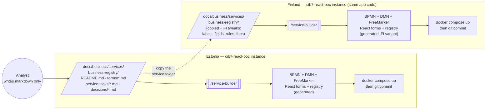

# eRegistrations — a CIB seven 2.2 + React human-task & service-task POC

A proof of concept: a [CIB seven](https://cibseven.org) 2.2 process engine runs
a BPMN process with **two human tasks**, a **DMN auto-approval decision**, a
**non-interrupting timer boundary event**, and **five connector-backed
service tasks** (one fetches a product price, one renders an approval PDF
via [Gotenberg](https://gotenberg.dev/), three POST email notifications —
one with the PDF attached — to [Mailpit](https://mailpit.axllent.org/)). A
**React** app opens each human task with its own hand-written form; the
**Cockpit / Tasklist / Admin** webapps are also bundled with full Keycloak
SSO.

The React SPA and the Keycloak login are branded **eRegistrations**;
"CIB seven" throughout this repo always refers to the underlying process
engine ([cibseven.org](https://cibseven.org)), not the app.

It is a slice of the larger design in
[`docs/human-role-react-forms-spec.md`](docs/human-role-react-forms-spec.md) —
see [Deviations from the spec](#deviations-from-the-spec) below.

## Live demo

A hosted instance runs at **<https://companylab.ai>** — try it without cloning
anything.

| User | Password | Role | Sees |
|---|---|---|---|
| `bart`  | `bart`  | applicant      | PartA — start & fill applications |
| `homer` | `homer` | civil servant  | PartB — review / accept / send back |
| `admin` | `admin` | Camunda admin  | Cockpit / Admin / Tasklist consoles |

Camunda webapps: <https://companylab.ai/camunda/app/cockpit/> · Keycloak admin:
<https://keycloak.companylab.ai/admin/> · **demo email inbox** (registration &
notification mail): <https://companylab.ai/mailpit>. The Traefik dashboard is
local-dev only. The table below is the **local `docker compose` equivalent** —
same logins, just swap `localhost:3000` for `companylab.ai`.

> **Shared inbox — don't enter real data.** The demo has Keycloak email
> verification on, and all mail (verification links + process notifications)
> lands in one **public** Mailpit inbox that any visitor can read. New
> registrants must open <https://companylab.ai/mailpit> to click their
> verification link. The SPA shows a demo banner (warning + a "Demo email
> inbox" link) above its header, and the Keycloak registration / verify-email
> pages carry the same warning inline.

## Test logins & consoles

| Console | URL | Login | Password |
|---|---|---|---|
| **React SPA** (PartA & PartB) | <http://localhost:3000> | `bart` / `homer` | same as username |
| &nbsp;&nbsp;↳ PartA — applicant | | `bart` | `bart` |
| &nbsp;&nbsp;↳ PartB — civil servant | | `homer` | `homer` |
| **CIB seven Admin** (users, groups, authorizations) | <http://localhost:3000/camunda/app/admin/> | `admin` | `admin` |
| **CIB seven Cockpit** (process instances, incidents) | <http://localhost:3000/camunda/app/cockpit/> | `admin` | `admin` |
| **CIB seven Tasklist** (legacy task UI) | <http://localhost:3000/camunda/app/tasklist/> | `admin` | `admin` |
| **CIB seven REST API** | <http://localhost:3000/engine-rest> | Bearer JWT from Keycloak | — |
| **Mailpit inbox** (process-sent emails) | <http://localhost:8025> (needs `docker compose --profile dev up -d mailpit-ui`) | — | — |
| **Keycloak admin console** (realm / users / clients) | <http://localhost:8180/admin/> | `admin` | `admin` |
| **Traefik dashboard** (inspect ingress routes) | <http://localhost:8081/dashboard/> | — | — |
| **Graylog** (centralised logs from every service) | <http://localhost:9900> (SSH tunnel on a server — see [Centralised logging](#centralised-logging-graylog)) | `admin` | `admin` |
| **MCP endpoint** (Claude Desktop, Cursor, Codex, …) | <http://localhost:3000/mcp> | OAuth2 PKCE via Keycloak | (browser pops, log in as `bart` / `homer`) |
| &nbsp;&nbsp;↳ OAuth resource metadata | <http://localhost:3000/.well-known/oauth-protected-resource> | — | — |

Everything except Keycloak comes in through a single Traefik ingress on port
3000. The engine container's 8080, the MCP container's 8090, the frontend's
80, and Mailpit's 8025/1025 are no longer published to the host — they are
reachable only via the path-routed front door (or, for Mailpit's web UI,
the opt-in `dev` profile). Keycloak stays on its own port to avoid moving
the issuer URL stamped into existing JWTs.

Role notes:

- **`bart`** (Bart Simpson) — `/applicant` group, sees PartA on the SPA.
- **`homer`** (Homer Simpson) — `/civil-servant` group, sees PartB on the SPA.
  Cannot access `/camunda` webapps (those need `/cib7-admin`).
- **`admin`** — `/cib7-admin` group only, dedicated Camunda administrator.
  Admin everything on the `/camunda` webapps; not used in the SPA UI flows.
- Engine authorizations for `/applicant` and `/civil-servant` are bootstrapped
  on startup by `cib7/src/main/java/com/poc/cib7/AuthorizationBootstrap.java`;
  `/cib7-admin` is handled by the cibseven-keycloak plugin's
  `administratorGroupName` setting (full admin powers).
- Both webapp and SPA logins go through **Keycloak SSO** against the
  `cib7-poc` realm; the underlying user store is
  [`keycloak/realm-export.json`](keycloak/realm-export.json).

The SPA picks the role-appropriate UI from the JWT's realm roles:

- **PartA — applicant:** Services + My processes. Bart starts a process, fills
  the applicant form, and watches the status. If a civil servant sends the
  case back, the row's status shows "Sent back for corrections" and Bart can
  reopen the form (with the send-back reason shown as a banner) and resubmit.
- **PartB — back office:** Tasks + Incidents. Homer reviews the submitted
  application, then **Accept** (process ends approved) or **Send back…**
  (writes a reason variable and loops back to the applicant task).

Full realm in `keycloak/realm-export.json`.

---

## What it does

Two services ship today: **Vehicle Registration** (`vehicleRegistration`)
and **Estonian OÜ Registration** (`businessRegistration`). Both share the
same shape; the vehicle flow end to end:

```
Vehicle Registration (BPMN + DMN)

  start (initiator = applicant)
    │
    ▼  Submit owner & vehicle details   user task   (applicant — PartA)
    │    names, age, email, ID-document upload, a vehicle picked from the
    │    curated registry, optional co-owners — assignee = ${initiator}
    │  ◀───────────────────────────────────────────────────────────────────┐
    ▼  Attach owner ID document   service task → backend /api/internal     │
    ▼  Co-owner signatures        multi-instance subprocess (email links,  │
    │    public /confirm-owner/{token} pages, message correlation)         │
    ▼  Look up vehicle in registry  service task (http-connector)          │
    │    GET {busBaseUrl}/api/public/registry/vehicles/{vin}       │
    │    → price, vehicleAgeYears, make/model/year/fuelType                │
    ▼  Auto-approval policy       business rule task (DMN)                 │
    │    age + price + vehicleAgeYears → autoDecision                      │
    ▼  Auto-approve? ── gateway ──else──▶ Transport Authority review       │
    │                                      user task (civil servant)       │
    │                                      ⏱ PT2M reminder · Accept /      │
    │                                      Send back ───────────────────────┘
    ▼  Generate + store state-fee invoice PDF  (pdf-renderer → backend S3)
    ▼  Wait for state fee payment   receive task — public /pay/{token} page,
    │    paid only on the provider's signed callback (demo bank)
    ▼  Generate + store registration certificate
    ▼  end — "Vehicle registered"
```

The OÜ flow swaps vehicle semantics for company founding (Articles of
Association upload, co-founder signing via `/sign-founder/{token}`, a flat
€265 fee, B-card extract at the end) — same building blocks throughout. Both
SPAs surface the case's position live: a **case-progress stepper** on every
case view, payment-required alerts in the applicant inbox, and wait-state
labels in the back-office worklist.

## Spec-first services — portable across instances

A business service is defined **once** as a markdown spec under
`docs/business/services/<service>/`. Everything else — BPMN, DMN, React
forms, FreeMarker payloads, the form registry — is generated from it by the
[`/service-builder`](.claude/skills/service-builder/SKILL.md) skill. The
markdown folder is the portable unit: copy it into another instance of this
app, tweak the country-specific bits, regenerate, and you have the same
service localized.


```mermaid
flowchart LR
  Analyst(("Analyst<br/>writes markdown only"))

  subgraph EE["Estonia — cib7-react-poc instance"]
    direction TB
    EE_Spec[/"docs/business/services/<br/>business-registry/<br/>README.md · forms/*.md<br/>service-tasks/*.md · decisions/*.md"/]
    EE_Builder[["/service-builder"]]
    EE_Code["BPMN + DMN + FreeMarker<br/>React forms + registry<br/>(generated)"]
    EE_Run["docker compose up<br/>then git commit"]
    EE_Spec --> EE_Builder --> EE_Code --> EE_Run
  end

  subgraph FI["Finland — cib7-react-poc instance (same app code)"]
    direction TB
    FI_Spec[/"docs/business/services/<br/>business-registry/<br/>(copied + FI tweaks:<br/>labels, fields, rules, fees)"/]
    FI_Builder[["/service-builder"]]
    FI_Code["BPMN + DMN + FreeMarker<br/>React forms + registry<br/>(generated, FI variant)"]
    FI_Run["docker compose up<br/>then git commit"]
    FI_Spec --> FI_Builder --> FI_Code --> FI_Run
  end

  Analyst --> EE_Spec
  EE_Spec -. "copy the<br/>service folder" .-> FI_Spec
```

- **Portable:** the markdown spec folder. One analyst-authored artifact
  describes the service end-to-end (flow, forms, integrations, decisions,
  roles, variables).
- **Per-instance:** the generated BPMN / React / DMN / FreeMarker
  (re-derived on each side by `/service-builder`) and the deployment
  (Docker, Keycloak realm, env vars).
- **Localization** lives in the spec, not in code. The FI variant edits the
  same markdown files — different field labels, different DMN rules
  (e.g. local fee thresholds), different email copy — and runs the builder
  again. The app code stays untouched.

For the step-by-step workflow — what each markdown file must define, how to
run the builder, how to test — see
[Add or modify a service](#add-or-modify-a-service).

## Architecture

```
  React SPA ──OIDC PKCE──▶ Keycloak ◀──Admin REST── cib7 engine service
   │   (keycloak-js)         │ ▲                    (identity provider plugin)
   │                         │ │ OAuth2 code flow
   │   Bearer JWT            │ │ (cib7-webapps client)
   ▼                         │ │
  /engine-rest               │ ▼
  /camunda/*  ─────▶  CIB seven 2.2 engine + REST + Cockpit/Tasklist/Admin
   │ (nginx / Vite      (cib7/ — Spring Boot, embedded engine, Postgres;
   │  proxy)             plugins + connectors only, no business endpoints)
   │                            │
   │                            ├──▶  http-connector → backend /api
   │                            │      (vehicle registry lookup, document
   │                            │       move-pending / server-upload)
   │                            ├──▶  http-connector → Mailpit  (notifications
   │                            │                       + PDF attachments)
   │                            └──▶  http-connector → pdf-renderer → Gotenberg
   │                                                   (HTML → PDF, internal)
   ▼
  /api/*  ────────▶  backend business microservice  (backend/ — Spring Boot 4)
                       public confirmations · payments · vehicle registry ·
                       documents (JPA metadata + RustFS S3 presigned URLs)
                       └──▶ /engine-rest  (cib7-business service account)
```

- The browser logs in against **Keycloak** (OIDC, PKCE) and then calls the
  same-origin paths `/engine-rest/...` (engine) and `/api/...` (backend)
  with a Bearer JWT where required. In Docker, **nginx**/Traefik route the
  paths; in dev, the **Vite** dev server does. No CORS configuration needed.
- The engine validates JWTs (Spring Security OAuth2 Resource Server) and the
  **CIB seven Keycloak Identity Provider Plugin** (`cibseven-keycloak` 2.1.0)
  reads users and groups from Keycloak's Admin REST API. Engine authorization
  is on, so `candidateGroups` on user tasks is enforced.
- The **backend** owns every business endpoint: the public token-link pages
  (owner confirmations, founder signing, state-fee payments), the curated
  vehicle registry, and document storage (presigned RustFS uploads, JPA
  `Document` metadata). It talks to the engine only via `/engine-rest`,
  authenticated as the `cib7-business` Keycloak service account.
- The BPMN/DMN files live in the engine module under
  `processes/<service>/` and are deployed on startup as **one named engine
  deployment per service** (`ServiceDeployments.java`), so each service
  versions and rolls back independently.
- The **Look up vehicle in registry** service task calls the backend's
  registry server-side via the official `http-connector`. The email service
  tasks reuse the same connector against Mailpit's `/api/v1/send` JSON
  endpoint; the PDF tasks call a tiny Node sidecar (`pdf-renderer/`) that
  fronts Gotenberg, then store the result through the backend's
  `/api/internal/documents/server-upload`.
- The **CIB seven webapps** (Cockpit / Tasklist / Admin) live under
  `/camunda/*` on the engine. A second `SecurityFilterChain` drives the
  Spring Security OAuth2 Authorization Code flow against the
  `cib7-webapps` Keycloak client and bridges the OIDC user into the
  engine's `IdentityService` via the cibseven-keycloak plugin's
  `ContainerBasedAuthenticationProvider` recipe.
- Both Java modules keep their state in **Postgres** (one container, a
  database each, schemas owned by Flyway); it survives restarts until
  `docker compose down -v`.
- Every service we write also ships its logs to **Graylog** as structured
  GELF, tagged with the service name, the log level and the Keycloak user id
  behind the request. Graylog is not published on any routable interface —
  see [Centralised logging](#centralised-logging-graylog) and
  [`docs/logging.md`](docs/logging.md).

## Security

The stack follows a written set of mandatory rules,
[`docs/security.md`](docs/security.md), each backed by negative tests. The
table maps the main controls to the
[OWASP Top 10 (2021)](https://owasp.org/Top10/). This is a design mapping,
not a certification. No external penetration test has been done.

| OWASP risk | Controls |
|---|---|
| A01 Broken access control | Least-privilege engine grants: applicants reach only the cases they started, through per-instance grants. Civil servants work only tasks routed to their group. Every document key and case id is checked against the caller. `/api` paths fall into public, internal or JWT classes, and anything unmatched is denied. |
| A02 Cryptographic failures | Co-owner, founder and payment links are HMAC-SHA256 signed and bound to case, party, round and expiry. They are never stored and are compared in constant time. HSTS sits on the TLS routers. |
| A03 Injection | Every form has a variable allowlist (`variable-policy.json`), so clients can't set system variables. Config beans can't be shadowed by process variables. FreeMarker output is escaped with `?json_string`/`?html`, and the MCP tools frame applicant text as untrusted for the LLM. |
| A04 Insecure design | Payment counts only on a provider callback signed with HMAC that matches the server-computed amount; the demo uses a mock bank. Capability links are minted server-side, never in the browser. |
| A05 Security misconfiguration | CSP, `X-Frame-Options`, `nosniff`, `Referrer-Policy`. Rate limits on public endpoints and MCP. Engine-only endpoints return 404 at the edge. `DefaultSecretsGuard` refuses dev-default secrets when `APP_REQUIRE_REAL_SECRETS=true`. |
| A06 Vulnerable components | Pinned images, Dependabot, `npm audit` and Trivy scans. Images are published only after the quality workflow passes. |
| A07 Authentication failures | Keycloak OIDC with PKCE. Tokens are kept in memory. JWT signature, issuer and audience are checked by the engine, the backend and MCP. |
| A08 Integrity failures | Internal calls need `X-Bus-Token` at the ESB and `X-Internal-Token` at the backend. CI deploys pin the image tag to the commit SHA. |
| A09 Logging and monitoring | Structured GELF logs with the acting user id go to Graylog, which is loopback-only. The engine history records who did what. |
| A10 SSRF | Every connector URL is built on a reserved `busBaseUrl` bean. Separate Docker networks isolate the services, and Gotenberg renders with JavaScript off and internal hosts on a deny list. |

**Code scanning:** besides the dependency, secret and image scans that run on
every push, the [`codeql`](.github/workflows/codeql.yml) workflow runs GitHub
CodeQL static analysis (`security-extended` queries) over the Java, TypeScript
and GitHub Actions code. It runs only when started by hand from the Actions
tab (**codeql** > **Run workflow**), and its findings appear under
**Security** > **Code scanning**.

**Demo exemptions:** the seeded users and passwords, dev-default secrets,
self-signed TLS, Keycloak `start-dev` and Postgres without TLS are accepted for the
demo and listed in `docs/security.md`. Replace them before real use.

## Talk to it from Claude Desktop (or any MCP client)

The same deployment is also reachable as an **MCP server** at
`/mcp`, so an MCP-capable AI assistant (Claude Desktop, Cursor, Codex,
Windsurf, claude.ai web Custom Connectors, …) can drive the deployment
in natural language. The sidecar serving this is at [`mcp/`](mcp/) —
see [`docs/mcp.md`](docs/mcp.md) for the full module guide.

**One-time setup** (per AI client).

Clients that speak the URL form natively (claude.ai web Custom
Connectors, Cursor with `connect_url`, etc.) just need
`http://localhost:3000/mcp` in their connector settings. Claude Desktop
on Windows currently doesn't — it rejects the `{"url":...}` config — so
go through the stdio bridge:

```bash
npm install -g mcp-remote
```

Then in `%APPDATA%\Claude\claude_desktop_config.json`:

```json
{
  "mcpServers": {
    "cib7": {
      "command": "node",
      "args": [
        "C:\\Users\\<you>\\git\\cib7-react-poc\\mcp\\cib7-bridge.mjs"
      ]
    }
  }
}
```

Fully quit Claude Desktop (tray → Quit) and reopen. The first MCP call
pops a browser to Keycloak — log in as a seeded user (`bart` / `bart`
applicant, `homer` / `homer` civil-servant) **or click "Register"** to
create your own account (verification email lands at Mailpit). The
client now has a valid Bearer and remembers it for the session.

**What you can do, end-to-end.** Eleven MCP tools cover the applicant
round trip, civil-servant review, and onboarding without anyone opening
the React SPA:

**Process tools** (forward the caller's Bearer to `/engine-rest`):

| Tool | Purpose |
|---|---|
| `list_services` | "What can I do here?" — enumerates `vehicleRegistration` and `businessRegistration`. |
| `describe_service(key)` | Returns the per-service variable schema + LLM training markdown. |
| `start_process(key, variables)` | Validates variables with Ajv, starts a real BPMN instance. |
| `list_my_tasks` | Tasks waiting on the current user (assigned OR claimable via candidate group). |
| `get_form_schema(taskId)` | Schema for a specific task's form. |
| `complete_task(taskId, variables)` | Validates against the task schema, auto-claims if needed, completes. |
| `list_my_processes` | Newest-first list of instances started by the current user, with state. |
| `query_user_history(variableName)` | Most recent value the user has ever entered — the autofill primitive. |

**Identity tools** (Keycloak; never handle a password):

| Tool | Purpose |
|---|---|
| `get_signup_url` | Returns the hosted Keycloak sign-up URL + steps. Pure URL lookup. |
| `get_password_reset_url` | Returns the hosted Keycloak password-reset URL + steps. Pure URL lookup. |
| `send_account_invitation(username, email, firstName, lastName)` | Creates an invite-pending Keycloak user and emails them a magic link. The invitee sets their own password in Keycloak's form. |

A canonical session as `bart`:

> *"What services are available on the cib7 server?"* → `list_services`
> *"Register a company called Acme — board members Alice Aaver*
> *38501234567 and Bob Bork 49012345678, share capital €5000."* →
> `describe_service('businessRegistration')` then
> `start_process('businessRegistration', {...})` — auto-approved by DMN
> because Bart is an adult and capital ≥ €2500. Approval email lands in
> Mailpit.

A canonical session as a new user:

> *"I'd like to register a new user — username lisa, email lisa@x.com,*
> *first name Lisa, last name Simpson."* → `send_account_invitation`.
> Invitee opens Mailpit, clicks the magic link, sets a password in
> Keycloak's hosted form, and lands in the SPA signed in. The MCP
> service never sees a password — Claude never asks for one.

For the Homer (civil-servant) side, log in as `homer` / `homer` in the
same OAuth pop — Claude's `list_my_tasks` then surfaces the review tasks
even though they're owned by the `civil-servant` candidate group (the
tool merges assigned + claimable, and `complete_task` auto-claims).

The MCP sidecar is a **stateless Bearer-proxy** — every tool call
forwards the AI client's Bearer token to `/engine-rest`, the engine
validates issuer + audience + signature, and authorization runs against
the same `IdentityService` the SPA uses. There's no separate user store,
no separate audit trail, no "AI service account." Everything an AI
agent does is attributable to a real Keycloak user.

For the full architecture story (why a sidecar instead of an in-engine
plugin like
[`krixerx/cibseven-mcp-plugin`](https://github.com/krixerx/cibseven-mcp-plugin),
how OAuth2 PKCE-loopback works, how the per-service manifests get
generated from the spec), read [`docs/mcp.md`](docs/mcp.md).

## Project layout

```
cib7-react-poc/
├── docker-compose.yml
├── cib7/                           CIB seven 2.2 Spring Boot engine module
│   │                               (engine + plugins + connectors ONLY — no
│   │                               business endpoints; those live in backend/)
│   ├── pom.xml
│   ├── Dockerfile
│   └── src/main/
│       ├── java/com/poc/cib7/
│       │   ├── Cib7PocApplication.java
│       │   ├── ConnectorConfiguration.java   registers the Connect plugin
│       │   ├── BusConfiguration.java         exposes ${busBaseUrl} (integration bus)
│       │   ├── FrontendConfiguration.java    exposes ${frontendBaseUrl} (email links)
│       │   ├── PdfHelper.java                @Component("pdf") base64↔byte[]
│       │   ├── AuthorizationBootstrap.java   grants /applicant engine perms
│       │   └── keycloak/                     Spring Security + Keycloak identity wiring
│       └── resources/
│           ├── application.yaml
│           ├── processes/<service>/          BPMN + DMN — one engine deployment per folder
│           └── templates/                    FreeMarker payloads for connectors
├── backend/                        Business microservice (Spring Boot 4)
│   │                               Owns every /api/** surface; talks to the
│   │                               engine only via /engine-rest using the
│   │                               cib7-business Keycloak service account
│   ├── pom.xml
│   ├── Dockerfile
│   └── src/main/
│       ├── java/com/poc/backend/
│       │   ├── BackendApplication.java
│       │   ├── engine/                       EngineClient (REST) + OAuth2 client-credentials wiring
│       │   ├── security/                     public / internal-token / JWT chains
│       │   ├── storage/                      S3 client + presigner + bucket bootstrap (RustFS)
│       │   ├── documents/                    Document JPA entity + repository + /api/documents
│       │   ├── owner/                        /api/public/owner-confirmations
│       │   ├── founder/                      /api/public/founder-signatures
│       │   ├── payment/                      /api/public/payments
│       │   └── registry/                     /api/{public,internal}/registry/<entity> (pack registries)
│       └── resources/application.yaml
├── pdf-renderer/                   Node sidecar (JSON-in/JSON-out over Gotenberg)
│   ├── server.js                   ~25 LOC Express wrapper
│   ├── gelf.js                     GELF UDP logger (service / level / no user)
│   ├── package.json
│   └── Dockerfile
├── esb/                            Integration bus (Apache Camel JBang, YAML routes)
│   ├── routes/*.yaml               one file per integration
│   ├── log4j2-graylog.xml          console + GELF TCP appender
│   └── Dockerfile
├── graylog/
│   └── provision-inputs.sh         creates the GELF UDP + TCP inputs, once
├── mcp/                            MCP sidecar — AI-callable surface (see docs/mcp.md)
│   ├── src/
│   │   ├── server.ts               Express + per-request MCP server/transport + 11 tools + LLM instructions
│   │   ├── auth/identity.ts        parses preferred_username for query construction
│   │   ├── auth/verify.ts          jose jwtVerify against Keycloak JWKS at the /mcp door
│   │   ├── engine/client.ts        Bearer-forward fetch wrapper to /engine-rest
│   │   ├── engine/variables.ts     plain JSON → Camunda { value, type } envelope
│   │   ├── keycloak/admin.ts       cib7-backend service-account token + admin REST wrapper
│   │   ├── logging/gelf.ts         GELF UDP logger (service / level / user_id)
│   │   └── services/manifest.ts    walks /app/services-spec, Ajv-compiles schemas
│   ├── cib7-bridge.mjs             stdio↔HTTP launcher for Claude Desktop on Windows
│   ├── package.json                @modelcontextprotocol/sdk, express, ajv, jose, tsx
│   ├── tsconfig.json
│   ├── Dockerfile                  node:20-alpine; build context is repo root
│   └── README.md                   quick-start + verify steps + troubleshooting
└── frontend/                       React + TypeScript + Vite app
    └── src/
        ├── api/
        │   ├── camundaClient.ts        typed /engine-rest client
        │   ├── bpmn.ts                 BPMN XML parsing (tasks, names, flow graph)
        │   ├── documentsApi.ts         /api/documents client (uploads, downloads)
        │   └── *Api.ts                 payments / confirmations / vehicle registry
        ├── pages/                      role-aware pages
        │   ├── ServicesPage.tsx        PartA — start a service
        │   ├── MyProcessesPage.tsx     PartA — applicant's instances + status
        │   ├── TasksPage.tsx           PartB — back-office task tree
        │   ├── IncidentsPage.tsx       PartB — open incidents + retry
        │   ├── TaskDetailPage.tsx      shared task form host
        │   └── CompletedProcessPage.tsx shared finished-process view
        └── forms/                      formKey → React component
```

---

## Run with Docker (recommended)

> **Just deploying, not developing?** You don't need this repository or a
> build at all — pre-built images are on Docker Hub. See
> [`deploy/README.md`](deploy/README.md) for the pull-only administrator
> guide (single-machine and TLS setups). To push a deploy to a server from
> GitHub instead of logging in to it, see [`docs/ci-cd.md`](docs/ci-cd.md).

Requires Docker with Compose.

```bash
docker compose up --build
```

All URLs and credentials are listed in the
[Test logins & consoles](#test-logins--consoles) table above.

When the SPA loads it redirects to Keycloak's login form. Use `bart` / `bart`
to play the applicant or `homer` / `homer` to play the back-office reviewer.
Every `/engine-rest` call carries the JWT and the engine enforces
`candidateGroups` / `assignee` against the user's realm roles + group
membership.

As **Bart (PartA):** start a service on the **Services** page, fill the
applicant form, and watch the row appear under **My processes** with a live
status. If the back office sends the case back, reopen the row to see the
reason banner and resubmit.

As **Homer (PartB):** the **Tasks** page groups every service's user tasks
with the active instances waiting at each step. Open a review task, then
**Accept** (process ends) or **Send back** with a reason (loops to the
applicant).

## Run locally (without Docker)

Requires **Java 17+** and **Node.js 20+**.

**Engine** (terminal 1):

```bash
cd cib7
mvn spring-boot:run
```

**Business backend** (terminal 2):

```bash
cd backend
mvn spring-boot:run
```

**Frontend** (terminal 3):

```bash
cd frontend
npm install
npm run dev
```

Then open <http://localhost:5173>. The Vite dev server proxies `/engine-rest`
to the engine on port 8080 and `/api` to the backend on port 8085.

---

## Add or modify a service

Services are **spec-first**. The analyst owns the markdown; the code is
generated from it. No one hand-edits BPMN or registers a form by hand.

```
  1) Analyst writes spec        2) Service builder generates       3) Test          4) Commit
  docs/business/services/   ─▶  cib7/.../processes/*.bpmn      ─▶  docker     ─▶  git
    <service>/                  cib7/.../processes/*.dmn           compose         add + commit
      README.md                 cib7/.../templates/*.ftl           up --build      a single
      forms/*.md                frontend/src/forms/<id>/                            atomic
      service-tasks/*.md        frontend/src/forms/registry.ts                      change
      decisions/*.md (DMN)      docs/.../README.md ▶ mermaid
```

### 1. Define (analyst — markdown only)

One folder per service under [`docs/business/services/<service>/`](docs/business/services/).
Two starting points:

- **Blank skeleton** —
  [`.claude/skills/service-builder/spec-template/`](.claude/skills/service-builder/spec-template/)
  has empty `README.md`, `forms/example-form.md`, `service-tasks/example-task.md`,
  and `decisions/example-decision.md` with placeholder fields and inline
  documentation on every section.
- **Worked example** —
  [`vehicle-registration/`](docs/business/services/vehicle-registration/README.md)
  is the canonical filled-in spec. Read it side-by-side with the templates
  to see what good looks like.

The folder is the **single source of truth**; if a fact isn't in the spec,
the builder won't emit code for it.

What the spec must cover:

| File | Defines | Becomes |
|---|---|---|
| `README.md` | Flow narrative, mermaid diagram, role/authorization matrix, process variables, known trade-offs | BPMN skeleton; the mermaid block is rewritten from the generated BPMN by [`scripts/bpmn-to-mermaid.mjs`](scripts/bpmn-to-mermaid.mjs) |
| `forms/<form-id>.md` | One file per user task: form id, audience, fields (name / type / required / validation), submit variables, send-back behaviour | One React component per form + a `registry.ts` entry; one `<bpmn:userTask camunda:formKey="react:<form-id>">` per file |
| `service-tasks/<task-id>.md` | One file per integration: HTTP method + URL, headers, payload template, response mapping, async semantics | One `<bpmn:serviceTask>` with inline `http-connector` config; FreeMarker payload under `packs/reference/engine/templates/` if non-trivial |
| `decisions/<decision-id>.md` (optional) | DMN inputs, outputs, hit policy, rules table | One `.dmn` file under `packs/reference/engine/processes/`; one `<bpmn:businessRuleTask camunda:decisionRef="...">` |

**Conventions the builder relies on:**

- Form ids and task ids are kebab-case and globally unique (the builder
  refuses duplicates).
- Process variable names are spelled exactly the same in `README.md`,
  every form spec, every service-task spec, and every decision spec —
  `firstName`, not `first_name` in one and `firstname` in another.
- Roles use **slash-less** Keycloak group ids (`applicant`, not `/applicant`)
  in `candidateGroups`; see the project memory on
  [cibseven-keycloak group-path stripping](docs/cib7.md#bpmn-files).
- Large variables (PDFs, images, anything > 4 kB) are declared as `byte[]`
  in the variables table so the engine spills them to `ACT_GE_BYTEARRAY`
  — see [`docs/cib7.md` § Large process variables](docs/cib7.md#large-process-variables-bytes-typed).
- DMN files **must** declare `historyTimeToLive` (CIB seven 2.2 hard rule).

### 2. Generate (service-builder skill)

Run [`/service-builder`](.claude/skills/service-builder/SKILL.md) on the
service folder. It reads every markdown file, validates them against the
conventions above, and writes:

- `packs/reference/engine/processes/<service>.bpmn`
- `packs/reference/engine/processes/<decision>.dmn` (if any)
- `packs/reference/engine/templates/<task>.json.ftl` (if any)
- `frontend/src/forms/<form-id>/` (one component per `forms/*.md`)
- `frontend/src/forms/registry.ts` — entries added / removed in place
- `docs/business/services/<service>/README.md` — the mermaid block is
  regenerated by [`scripts/bpmn-to-mermaid.mjs`](scripts/bpmn-to-mermaid.mjs)

**Modifications work the same way** — edit the markdown, re-run the
builder, and the existing code is rewritten in place. Never hand-edit
generated files; the next builder run will overwrite the change.

For a new service that needs a new top-level navigation entry in PartA,
the builder also drops a row into the Services page; for back-office tasks
it threads them into the Tasks tree via the standard `formKey` lookup, so
no extra wiring is needed.

### 3. Test locally (Docker)

```bash
docker compose up --build
```

The engine redeploys the BPMN / DMN on startup —
[`ServiceDeployments.java`](cib7/src/main/java/com/poc/cib7/ServiceDeployments.java)
creates one named deployment per `processes/<service>/` folder, with
duplicate filtering so unchanged services don't re-version. Walk the
happy path and at least one edge case through the SPA:

1. **PartA — start the service as `bart`**, fill each user form, watch
   the row in **My processes** advance through each step.
2. **PartB — pick up the task as `homer`**, exercise every gateway branch
   (approve, send-back, timer-driven side effects, …).
3. Check **Mailpit** at <http://localhost:8025> for any notification
   emails the flow emits (requires `docker compose --profile dev up -d
   mailpit-ui` once per session — the default profile keeps the inbox
   network-internal).
4. Check **Cockpit** at <http://localhost:3000/camunda/app/cockpit/> for
   incidents; an incident means the engine hit something the spec didn't
   cover — fix the spec, re-run the builder, redeploy.

> The frontend mounts the form via the registry, so an unknown `formKey`
> shows up as a clear runtime error in the task page. Cockpit shows
> connector / DMN / FreeMarker failures as engine incidents.

If the change is frontend-only, `npm run dev` (Vite, terminal 2) gives a
faster loop — see [Run locally](#run-locally-without-docker).

### 4. Commit

Commit the spec **and** the generated files in a single atomic change so
the repo always builds:

```
docs/business/services/<service>/...   (the source of truth)
packs/reference/engine/processes/...  (generated)
packs/reference/engine/templates/...  (generated, if any)
frontend/src/forms/...                 (generated)
frontend/src/forms/registry.ts         (generated)
```

A commit message of the form `<service>: <what changed in the spec>`
keeps `git log` readable from the analyst's perspective.

---

## UI and styling

The SPA uses its own design system in plain CSS, with **MUI v5** only for the
complex data grid on the Incidents page.

- **Tokens** ([`frontend/src/styles/tokens.css`](frontend/src/styles/tokens.css))
  define every colour for a light and a dark scheme, the category accents, the
  fonts (Sora for headings, Instrument Sans for text, Red Hat Mono for case
  references, Noto Sans Arabic under `lang="ar"`) and radii.
  `<html data-theme>` selects the scheme; `public/theme-init.js` sets it
  before first paint and [`src/theme/colorScheme.ts`](frontend/src/theme/colorScheme.ts)
  owns the toggle.
- **Area stylesheets** under `frontend/src/styles/` (base, shell, landing,
  cases, forms, back office, public pages) build on the tokens. Generated
  forms keep the generator's class contract (`field`, `field-input`,
  `form-banner`, `btn btn-primary`), so a restyle never needs a regeneration.
- **Icons** come from [Lucide](https://lucide.dev) via `lucide-react`.
- **MUI** is themed per scheme in [`frontend/src/theme/mui.ts`](frontend/src/theme/mui.ts)
  and wraps only the [`IncidentsPage`](frontend/src/pages/IncidentsPage.tsx) grid.

TEDI was removed in favour of this system: it was used by one form and one
button, fought the portal's own styling, and has no Arabic microcopy.

## How the form wiring works

Each BPMN user task carries a `camunda:formKey`:

```xml
<bpmn:userTask id="Task_SubmitDetails" name="Submit personal details"
               camunda:formKey="react:owner-vehicle" />
```

The React app reads the task's `formKey` from the REST API, strips the
`react:` prefix, and looks the form id up in `src/forms/registry.ts`:

```ts
export const formRegistry = {
  'owner-vehicle':  OwnerVehicleForm,
  'vehicle-review': VehicleReviewForm,
  // + business-details, review-business-registration
};
```

**To add a form:** add a user task with a new `camunda:formKey` in the BPMN,
create the component under `src/forms/`, and add one registry entry.

## Service task & the http-connector

The **Look up vehicle in registry** service task uses the official
[`cibseven-connect-http-client`](https://mvnrepository.com/artifact/org.cibseven.connect/cibseven-connect-http-client)
connector — a CIB seven Connect SPI connector that wraps Apache HttpClient 5.
It is wired in two places:

- **Connect plugin** — `ConnectorConfiguration` registers
  `ConnectProcessEnginePlugin` so the engine parses `<camunda:connector>`.
  The `cibseven-connect-http-client` dependency declared in `cib7/pom.xml`
  registers the connector itself through the Connect SPI.
- **BPMN** — the service task carries the connector config inline. The
  response body comes back as the `response` variable; Spin (bundled with the
  CIB seven engine) parses it inline — with per-property fallbacks so a
  malformed response degrades to "review" instead of crashing:

  ```xml
  <camunda:connector>
    <camunda:connectorId>http-connector</camunda:connectorId>
    <camunda:inputOutput>
      <camunda:inputParameter name="url">${busBaseUrl}/api/public/registry/vehicles/${objectId}</camunda:inputParameter>
      <camunda:inputParameter name="method">GET</camunda:inputParameter>
      <camunda:inputParameter name="headers">
        <camunda:map>
          <camunda:entry key="Accept">application/json</camunda:entry>
        </camunda:map>
      </camunda:inputParameter>
      <camunda:outputParameter name="price">${!S(response).hasProp('value') ? 9999 : S(response).prop('value').numberValue()}</camunda:outputParameter>
    </camunda:inputOutput>
  </camunda:connector>
  ```

The service task runs `asyncBefore`, so after the first form is confirmed the
job executor runs the connector — the **Auto approval?** DMN task runs next,
and depending on the outcome either the process ends or the **Review
application** task appears a moment later (use the Tasks page **Refresh**
button).

## DMN decision table

[`packs/reference/engine/processes/vehicle-registration/vehicle-auto-approval.dmn`](packs/reference/engine/processes/vehicle-registration/vehicle-auto-approval.dmn)
is deployed alongside the BPMN. It has two inputs — `age` (Integer) and
`price` (Double) — and a single string output `autoDecision`. Hit policy is
`FIRST`: minors always go to review, adults with cheap picks auto-approve,
everything else goes to review.

The Business Rule Task references it inline, bound to the decision version
that shipped in the same service deployment:

```xml
<bpmn:businessRuleTask id="Task_AutoDecide" name="Auto approval?"
                       camunda:decisionRef="vehicle-auto-approval"
                       camunda:decisionRefBinding="deployment"
                       camunda:mapDecisionResult="singleEntry"
                       camunda:resultVariable="autoDecision" />
```

Each service's BPMN + DMN files live under
`packs/reference/engine/processes/<service>/` and are deployed as **one
named engine deployment per service** by
[`ServiceDeployments.java`](cib7/src/main/java/com/poc/cib7/ServiceDeployments.java)
(the starter's single-bundle auto-deploy is off — `camunda.bpm.auto-deployment-enabled: false`
in [`application.yaml`](cib7/src/main/resources/application.yaml)). Editing
one service re-versions only that service; the others are duplicate-filtered
no-ops, and each service can be rolled back or deleted in Cockpit
independently.

## Timer boundary event + Mailpit

The **Review application** user task carries a non-interrupting timer
boundary event (`R/PT2M`). Every two minutes while the task is open the
engine job executor fires a parallel branch into a **Send reminder email**
service task — the user task itself stays open and can fire again. The
service task is just the `http-connector` POSTing to the integration bus,
which forwards to Mailpit's `/api/v1/send` JSON endpoint:

```xml
<camunda:inputParameter name="url">${busBaseUrl}/api/v1/send</camunda:inputParameter>
<camunda:inputParameter name="method">POST</camunda:inputParameter>
<camunda:inputParameter name="payload">{
  "From": { "Email": "process@cib7-poc.local", "Name": "CIB7 POC" },
  "To":   [ { "Email": "civil-servant@cib7-poc.local" } ],
  "Subject": "Reminder: application waiting for review",
  "Text": "An application from ${firstName} ${lastName} has been waiting…"
}</camunda:inputParameter>
```

The same connector is reused on the send-back path to email the applicant
(`${initiator}@cib7-poc.local`) the rejection reason before looping back. The
`${busBaseUrl}` variable is exposed by
[`BusConfiguration.java`](cib7/src/main/java/com/poc/cib7/BusConfiguration.java)
as a Spring bean, driven by the `BUS_URL` env var (`http://esb:8080` in
Docker). It points at the integration bus (`esb`, Apache Camel), which routes
`/api/v1/send` to Mailpit — the engine never addresses Mailpit directly. See
the [Integration bus](docs/architecture.md#system-overview) note.

[Mailpit](https://mailpit.axllent.org/) (`axllent/mailpit:latest`) is a tiny
SMTP server + web UI; the inbox at <http://localhost:8025> visualizes every
email the process sends. The default `docker compose up` keeps Mailpit
network-internal — bring the inbox online with `docker compose --profile
dev up -d mailpit-ui`, which spins up a socat sidecar that publishes
:8025 to the host on demand.

## PDF generation (Gotenberg + pdf-renderer)

When the case ends in approval and the applicant provided an email, a
**Generate approval PDF** service task runs before the approval email. It is
yet another `http-connector` call — this time to the bus at
`${busBaseUrl}/render`, which routes to the `pdf-renderer/` sidecar; it takes
JSON `{html, filename}`
and returns JSON `{filename, base64}`. The sidecar internally POSTs
`multipart/form-data` to **Gotenberg** (`gotenberg/gotenberg:8`, headless
Chromium) and base64-encodes the binary response — both warts that would
otherwise force the BPMN out of the connector pattern into a custom Java
delegate.

The decoded PDF lands in the `approvalPdfBytes` process variable as a
`byte[]` (not `String`), so the engine spills it into `ACT_GE_BYTEARRAY`
instead of the 4000-char `ACT_HI_VARINST.TEXT_` column. The
`approval-email.json.ftl` template re-encodes to base64 with
`${pdf.encode(approvalPdfBytes)}` when assembling the Mailpit attachment.
See [`docs/cib7.md` § Large process variables](docs/cib7.md#large-process-variables-bytes-typed)
for the rationale and the corresponding `PdfHelper` bean.

## Cockpit / Tasklist / Admin webapps with Keycloak SSO

The `cibseven-bpm-spring-boot-starter-webapp` dependency mounts the classic
CIB seven webapps at `/camunda/**`. A second Spring Security filter chain
(`com.poc.cib7.keycloak.webapp.WebappSecurityConfig`) drives an OAuth2
Authorization Code flow against the `cib7-webapps` Keycloak client; once the
user is logged in, `ContainerBasedAuthenticationFilter` calls
`KeycloakAuthenticationProvider.extractAuthenticatedUser`, which reads the
OIDC user and queries groups via the cibseven-keycloak plugin's read-only
`IdentityService` — the same identity model the `/engine-rest` Bearer-JWT
filter uses. The three Java files under `com/poc/cib7/keycloak/webapp/` are
the plugin's published recipe (`examples/sso-kubernetes`), repackaged.

URL split — internal vs browser-visible — is handled in
[`application.yaml`](cib7/src/main/resources/application.yaml) by listing
every OAuth2 endpoint explicitly (no `issuer-uri`, which would trigger OIDC
discovery against an URL the engine container can't reach):

```yaml
spring.security.oauth2.client.provider.keycloak:
  authorization-uri: http://localhost:8180/...  # browser
  token-uri:         http://keycloak:8080/...   # backend
  jwk-set-uri:       http://keycloak:8080/...   # backend
  user-info-uri:     http://keycloak:8080/...   # backend
```

Log in at <http://localhost:3000/camunda> as `admin` / `admin` for the
Cockpit / Tasklist / Admin webapps (the `/cib7-admin` group is the one
authorized for those webapps; `homer` and `bart` are intentionally
locked out).

## Centralised logging (Graylog)

Every service in this stack logs twice: to stdout, so `docker compose logs -f
<service>` keeps working, and to **Graylog** as a structured **GELF** message.
Each message carries the **service name**, the **log level** (both GELF's
numeric syslog severity and a readable `level_name`), and the **Keycloak user
id** of the person whose request produced it, where there is one. Full detail —
the field contract, the per-runtime wiring, troubleshooting — is in
[`docs/logging.md`](docs/logging.md).

```
cib7          ──GELF/UDP 12201──┐
backend       ──GELF/UDP 12201──┤
mcp           ──GELF/UDP 12201──┼──▶ graylog ──▶ opensearch       (message store)
pdf-renderer  ──GELF/UDP 12201──┤        └─────▶ graylog-mongodb  (config store)
esb           ──GELF/TCP 12201──┘
```

### Access is loopback + SSH tunnel, never public

Nothing in the Graylog stack is published on a routable interface. The web UI is
bound to `127.0.0.1:9900` on the host, the GELF inputs are not published at all
(shippers are sibling containers reaching `graylog:12201` over the docker
network), and Traefik has no route to it. On a server:

```bash
ssh -N -L 9900:127.0.0.1:9900 <user>@<host>
```

then open <http://localhost:9900> and log in as `admin` / `admin` (the dev
default; set `GRAYLOG_ROOT_PASSWORD` + `GRAYLOG_ROOT_PASSWORD_SHA2` in `.env`
for anything real). Running the stack on your own laptop needs no tunnel —
<http://localhost:9900> is already the bound address.

Port 9900 rather than Graylog's native 9000 because RustFS already owns host
port 9000 here. If you tunnel to a different local port, set
`GRAYLOG_HTTP_EXTERNAL_URI` to match, or the UI will load and then fail every
request.

### What you get

Searches worth knowing, once you are in:

```
service:cib7 AND level_name:ERROR
user_id:bart
service:mcp AND _tool:start_process
```

`user_id` is deliberately **absent** rather than empty when no user is
attributable: the `esb` bus and `pdf-renderer` handle machine-to-machine calls,
the backend's `/api/public/**` token links have no session, and engine→backend
calls authenticate with a shared header. For a service-account token the value
is the client id.

### First start

The two GELF inputs are created automatically by a one-shot `curl` sidecar
(`graylog/provision-inputs.sh`), because Graylog keeps inputs in MongoDB and a
fresh volume has nothing listening on 12201. It is idempotent. If no messages
ever show up, that is the first place to look:

```bash
docker compose logs graylog-init     # echoes every API response
docker compose logs graylog          # cold start takes a couple of minutes
```

The Graylog stack adds roughly 2 GB of memory on top of the rest of the POC
(OpenSearch, Graylog and MongoDB together). `docker compose down -v` wipes the
message store, Graylog's configuration and the provisioned inputs.

**Graylog is not a replacement for Cockpit.** A failed connector, DMN or
FreeMarker template still surfaces as an engine incident at
`/camunda/app/cockpit/` with the variables and the retryable job attached.
Graylog has the log line; Cockpit has the thing you can retry.

## REST endpoints used

All under `/engine-rest` (standard CIB seven / Camunda 7 REST API):

| Call | Purpose |
|------|---------|
| `GET  /process-definition?latestVersion=true` | List services (process definitions) |
| `GET  /process-definition/key/{key}/xml` | BPMN XML — read the model's user tasks |
| `POST /process-definition/key/{key}/start` | Start a process instance |
| `GET  /task` | List open tasks |
| `GET  /task?processInstanceId={id}` | Open tasks of one instance |
| `GET  /task/{id}` | Task details, including `formKey` |
| `GET  /task/{id}/form-variables` | Process variables for the form |
| `POST /task/{id}/complete` | Complete the task with typed variables |

---

## Deviations from the spec

This POC intentionally simplifies `docs/human-role-react-forms-spec.md`:

| Spec | This POC | Why |
|------|----------|-----|
| `cib:` BPMN namespace (§5.3) | Standard **`camunda:`** namespace | CIB seven 2.2 uses `camunda:` — confirmed against the official `cibseven-get-started-spring-boot` example. The spec's §5.3 is inaccurate. |
| BFF between React and engine (D11) | React calls **`/engine-rest` directly** with a Bearer JWT | Bearer auth + the resource-server filter chain in front of the engine is the production-acceptable middle ground until a BFF is added. |
| Form manifest + publish-time validation (§11) | Omitted | The BPMN is a single static file, not dynamically generated. |
| Single `json` Spin variable (§10) | Plain typed variables (`firstName`, `objectId`, `price`, `decision`, …) | Simpler; no Spin needed for a POC. |
| Separate edit/view form components (§8.2–8.3) | One component per form | The "entry then review" flow already gives one edit form and one read-only review form. |
| IdP groups → candidate groups | **Keycloak groups `/applicant` (assignee via `${initiator}`) and `/civil-servant` (candidateGroup `civil-servant` — slash stripped by the plugin)** | Implemented via `cibseven-keycloak` 2.1.0 with `useGroupPathAsCamundaGroupId: true`. The plugin maps path `/civil-servant` to engine group id `civil-servant`; see [`docs/cib7.md`](docs/cib7.md#bpmn-files). |

For a production system the spec's BFF and manifest validation would be
reinstated.

## Notes & limitations

- Keycloak runs in `start-dev` mode with its own in-memory H2 — the realm is
  re-imported from `keycloak/realm-export.json` on every container start, so
  user-created users/groups are also lost on restart.
- The vehicle catalog is a ten-entry stand-in declared in the service pack
  (`data/vehicles.md`) and served by the backend's registry module
  (`/api/public/registry/vehicles`) — no real Liiklusregister behind it.
- The DMN's `PT2M` timer cycle is a demo value — switch to `PT8H` / `PT1D`
  for anything real, otherwise Mailpit fills up fast.
- Mailpit's storage is non-persistent (no volume mounted); restarting the
  container empties the inbox.
