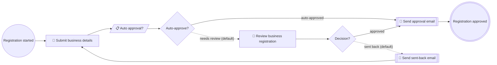

# Business Registration

**Status:** active (POC)
**Process key:** `businessRegistration`
**BPMN:** [`cib7/src/main/resources/processes/business-registration/business-registration.bpmn`](../../../../cib7/src/main/resources/processes/business-registration/business-registration.bpmn)
**DMN:** [`cib7/src/main/resources/processes/business-registration/business-auto-approval.dmn`](../../../../cib7/src/main/resources/processes/business-registration/business-auto-approval.dmn)

**When to read this:** before changing the businessRegistration flow, its
forms, or its integrations. Cross-cutting topics live in
[`../../../architecture.md`](../../../architecture.md),
[`../../../cib7.md`](../../../cib7.md),
[`../../../frontend.md`](../../../frontend.md), and
[`../../../human-role-react-forms-spec.md`](../../../human-role-react-forms-spec.md).

## What this service does

An applicant registers a new Estonian limited liability company (OÜ) by
providing the company name, board members (with personal codes), and share
capital amount. Adults submitting at least the legal minimum share capital
(€2500) are auto-approved by a DMN rule and notified by email; everyone else
is routed to a civil-servant queue for manual review. If the case is sent
back for corrections, the applicant fixes the data and resubmits — the loop
reuses the same applicant task. This service is also the showcase of the
spec-first × MCP pipeline: the same markdown spec drives BPMN, React forms,
DMN, the MCP manifest, and the LLM training context.

## Flow

```
start              Registration started                    initiator=initiator
user-task          submit-business-details "Submit business details"  form=business-details role=initiator
business-rule-task auto-decide "Auto approval?"             decision=business-auto-approval result=autoDecision
gateway-exclusive  auto-approval "Auto-approve?"            default=needs-review
user-task          review-business-registration "Review business registration"  form=review-business-registration group=civil-servant
gateway-exclusive  decision "Decision?"                     default=sent-back
service-task       send-approval-email "Send approval email"  (see service-tasks/send-business-approval-email.md)
service-task       send-back-email "Send sent-back email"     (see service-tasks/send-business-sendback-email.md)
end                approved "Registration approved"

flow               start -> submit-business-details
flow               submit-business-details -> auto-decide
flow               auto-decide -> auto-approval
flow               auto-approval -> send-approval-email     label="auto-approved" if=${autoDecision == "approve"}
flow               auto-approval -> review-business-registration  label="needs review (default)"
flow               review-business-registration -> decision
flow               decision -> send-approval-email          label="approved" if=${decision == "approve"}
flow               decision -> send-back-email              label="sent back (default)"
flow               send-back-email -> submit-business-details
flow               send-approval-email -> approved
```

## Forms

| Form id | BPMN task | Audience | Spec |
|---|---|---|---|
| `business-details` | `Task_SubmitBusinessDetails` | initiator | [`forms/business-details.md`](forms/business-details.md) |
| `review-business-registration` | `Task_ReviewBusinessRegistration` | `civil-servant` group | [`forms/review-business-registration.md`](forms/review-business-registration.md) |

## Service tasks

| BPMN task | Kind | Spec |
|---|---|---|
| `Task_SendApprovalEmail` | http-connector | [`service-tasks/send-business-approval-email.md`](service-tasks/send-business-approval-email.md) |
| `Task_SendBackEmail` | http-connector | [`service-tasks/send-business-sendback-email.md`](service-tasks/send-business-sendback-email.md) |
| `Task_AutoDecide` | DMN business rule | decision `business-auto-approval` (`singleEntry` -> `autoDecision`) |

## Decisions

| BPMN task | DMN | Spec |
|---|---|---|
| `Task_AutoDecide` | `business-auto-approval` | [`decisions/business-auto-approval.md`](decisions/business-auto-approval.md) |

## Process variables

| Variable | Set by | Type | Notes |
|---|---|---|---|
| `initiator` | start event | String | Login of the applicant who started the case. |
| `companyName` | `Task_SubmitBusinessDetails` | String | Trade name. By Estonian law the suffix must be "OÜ" for limited liability; the React form enforces this and the LLM training markdown tells the agent to ask if missing. |
| `boardMembers` | `Task_SubmitBusinessDetails` | Json | List of `{firstName, lastName, personalCode}`. Min length 1. Personal codes follow the Estonian 11-digit format; not strictly validated in POC. |
| `shareCapital` | `Task_SubmitBusinessDetails` | Double | Share capital in EUR. Minimum 2500 by historical Estonian Commercial Code; the React form and the LLM training enforce this. |
| `applicantFirstName` | `Task_SubmitBusinessDetails` | String | Applicant's first name. Autofilled by the MCP agent from `query_user_history('firstName')` when available; the user is asked to confirm. |
| `applicantLastName` | `Task_SubmitBusinessDetails` | String | Applicant's last name. Autofill pattern same as above. |
| `applicantAge` | `Task_SubmitBusinessDetails` | Integer | Applicant's age. Autofill pattern same as above. Used by the auto-approval DMN. |
| `autoDecision` | `Task_AutoDecide` (DMN) | String | `"approve"` or `"review"`. |
| `decision` | `Task_ReviewBusinessRegistration` | String | `"approve"` or `"sendback"`. |
| `sendBackReason` | `Task_ReviewBusinessRegistration` | String | Reason for the loop-back. The applicant sees this as a banner above the form on resubmit; the React form clears it on next submit so a future cycle starts clean. |

## Roles and authorization

- **Applicant** — Keycloak group `applicant` (engine sees `applicant`, no
  leading slash; see project memory on cibseven-keycloak group-path
  stripping). Owns `Task_SubmitBusinessDetails` via
  `camunda:assignee="${initiator}"`.
- **Civil servant** — Keycloak group `civil-servant`. Owns
  `Task_ReviewBusinessRegistration` via `candidateGroups="civil-servant"`.

`AuthorizationBootstrap.java` grants the applicant group READ +
CREATE_INSTANCE + READ_INSTANCE + READ_HISTORY + UPDATE_INSTANCE +
READ_TASK + UPDATE_TASK on the `businessRegistration` definition (same
shape as the `personRegistration` grants — extend the bootstrap to cover
both, or widen to `ProcessDefinition:*` as captured in eng-review T9).

## Known trade-offs

- **Personal-code validation is loose.** The form enforces 11 digits but
  does not implement the Estonian personal-code checksum. A real
  registration would call out to the population registry; the POC accepts
  any 11-digit string.
- **Share-capital floor is hard-coded at €2500.** The actual Estonian
  minimum was relaxed in 2023 but the POC keeps the historical floor for
  demo clarity (auto-approve vs review story).
- **No registry-code allocation.** Real OÜ registration assigns a
  state-issued 8-digit registry code. The POC skips this — the only
  output is an internal process instance id.
- **Send-back loop reuses the same applicant task.** The form must accept
  both first-submit and resubmit modes — banner with the reason on
  resubmit, cleared on next submit. Same pattern as person-registration.

## LLM guidance

The applicant interacts with this service primarily through MCP (Claude
Desktop / Cursor / Codex). Notes for the assistant:

- If the user gives a company name without the "OÜ" suffix, ask whether to
  append it before calling start_process — the form rejects names without
  it and the user is more annoyed by an Ajv error than by one clarifying
  question.
- If the user gives share capital below 2500, ask whether they meant a
  different company form (sole proprietorship, MTÜ non-profit) — for OÜ
  the 2500 minimum is the floor.
- **Always** call query_user_history on `firstName`, `lastName`, and
  birth-year-derived `age` before asking the applicant for these. If
  history exists, pre-fill and confirm in one message rather than
  re-prompting field by field.
- Status `running` with `Review business registration` open is normal and
  typical in production takes 1–2 business days. In this POC the reviewer
  (Homer) usually acts immediately; don't tell the user the process is
  stuck unless `list_my_processes` shows no recent state change for a
  while.
- The send-back loop is recoverable. If `query_user_history('sendBackReason')`
  returns a value for a running instance, surface it to the user and offer
  to correct the previous submission rather than starting from scratch.

## Flow diagram

The block below is generated from the BPMN by
[`scripts/bpmn-to-mermaid.mjs`](../../../../scripts/bpmn-to-mermaid.mjs).
Do not edit between the markers — run the script to refresh:

```sh
cd scripts
node bpmn-to-mermaid.mjs \
  ../cib7/src/main/resources/processes/business-registration/business-registration.bpmn \
  --out ../docs/business/services/business-registration/README.md
```

<!-- bpmn-diagram:start -->

<!-- bpmn-diagram:end -->
