# Person Registration

**Status:** active (POC)
**Process key:** `personRegistration`
**BPMN:** [`cib7/src/main/resources/processes/person-registration.bpmn`](../../../../cib7/src/main/resources/processes/person-registration.bpmn)
**DMN:** [`cib7/src/main/resources/processes/auto-approval.dmn`](../../../../cib7/src/main/resources/processes/auto-approval.dmn)

**When to read this:** before changing the person-registration flow, its forms,
or its integrations. Cross-cutting topics (platform architecture, engine config,
form contract) live in [`../../../architecture.md`](../../../architecture.md),
[`../../../cib7.md`](../../../cib7.md), [`../../../frontend.md`](../../../frontend.md),
and [`../../../human-role-react-forms-spec.md`](../../../human-role-react-forms-spec.md).

## What this service does

An applicant submits personal details. The engine fetches a price from an
external API, runs a DMN decision to see whether the case auto-approves, and
otherwise routes to a civil servant for review. The civil servant can approve
or send the case back for corrections (which loops to the applicant). On
approval, the applicant is emailed if they provided a valid address.

## Flow diagram

The block below is generated from the BPMN by
[`scripts/bpmn-to-mermaid.mjs`](../../../../scripts/bpmn-to-mermaid.mjs).
Do not edit between the markers — run the script to refresh:

```sh
cd scripts
node bpmn-to-mermaid.mjs \
  ../cib7/src/main/resources/processes/person-registration.bpmn \
  --out ../docs/business/services/person-registration/README.md
```

Legend: 👤 user task · 🔌 HTTP service task · 📋 DMN business-rule task ·
⏱ timer · diamond = exclusive gateway · dashed edge = default flow or
non-interrupting boundary attachment.

```mermaid
flowchart LR
  %% Person Registration
  StartEvent_1(("Registration started"))
  Task_SubmitDetails["👤 Submit personal details"]
  Task_Review["👤 Review application"]
  Task_GetPrice[["🔌 Get price"]]
  Task_SendReminderEmail[["🔌 Send reminder email"]]
  Task_GeneratePdf[["🔌 Generate approval PDF"]]
  Task_SendApprovalEmail[["🔌 Send approval email"]]
  Task_SendBackEmail[["🔌 Send &quot;sent back&quot; email"]]
  Task_AutoDecide[/"📋 Auto approval?"/]
  Gateway_AutoApproval{"Auto-approve?"}
  Gateway_Decision{"Decision?"}
  Gateway_SendApprovalEmail{"Has applicant email?"}
  BoundaryEvent_ReviewReminder(("⏱ Every 2 min"))
  EndEvent_ReminderSent((("Reminder sent")))
  EndEvent_Approved((("Application approved")))
  Task_Review -. attached (non-interrupting) .-> BoundaryEvent_ReviewReminder
  StartEvent_1 --> Task_SubmitDetails
  Task_SubmitDetails --> Task_GetPrice
  Task_GetPrice --> Task_AutoDecide
  Task_AutoDecide --> Gateway_AutoApproval
  Gateway_AutoApproval -- "auto-approved" --> Gateway_SendApprovalEmail
  Gateway_AutoApproval -. "needs review (default)" .-> Task_Review
  BoundaryEvent_ReviewReminder --> Task_SendReminderEmail
  Task_SendReminderEmail --> EndEvent_ReminderSent
  Task_Review --> Gateway_Decision
  Gateway_Decision -- "approved" --> Gateway_SendApprovalEmail
  Gateway_SendApprovalEmail -- "valid email" --> Task_GeneratePdf
  Task_GeneratePdf --> Task_SendApprovalEmail
  Gateway_SendApprovalEmail -. "default" .-> EndEvent_Approved
  Task_SendApprovalEmail --> EndEvent_Approved
  Gateway_Decision -. "sent back (default)" .-> Task_SendBackEmail
  Task_SendBackEmail --> Task_SubmitDetails
```

<!-- bpmn-diagram:start -->

<!-- bpmn-diagram:end -->

## Forms

| Form id (registry key) | BPMN task | Audience | Source |
|---|---|---|---|
| `personal-details` | `Task_SubmitDetails` | applicant (initiator) | [`frontend/src/forms/personal-details/`](../../../../frontend/src/forms/) |
| `review-application` | `Task_Review` | `civil-servant` group | [`frontend/src/forms/review-application/`](../../../../frontend/src/forms/) |

Form contract: see [`../../../human-role-react-forms-spec.md`](../../../human-role-react-forms-spec.md).
Registry resolution lives in `frontend/src/forms/registry.ts`.

## Service tasks (integrations)

| BPMN task | Kind | Target | Notes |
|---|---|---|---|
| `Task_GetPrice` | http-connector | `https://api.restful-api.dev/objects/${objectId}` | Reads `data.price` via Spin into `price`. Async-before. |
| `Task_SendReminderEmail` | http-connector | Mailpit `POST /api/v1/send` | Fires on boundary timer (every 2 min, non-interrupting). |
| `Task_GeneratePdf` | http-connector | `pdf-renderer` (`POST /render`) → Gotenberg | Payload from FreeMarker template `templates/approval-pdf.json.ftl`. Decoded base64 → `byte[]` via `${pdf.decode(...)}` so the variable spills to `ACT_GE_BYTEARRAY` (see [`../../../cib7.md` § Large process variables](../../../cib7.md#large-process-variables-bytes-typed)). |
| `Task_SendApprovalEmail` | http-connector | Mailpit `POST /api/v1/send` | Payload from FreeMarker template `templates/approval-email.json.ftl`. Attaches the PDF via `${pdf.encode(approvalPdfBytes)}`. |
| `Task_SendBackEmail` | http-connector | Mailpit `POST /api/v1/send` | Inline payload; loops back to applicant. |
| `Task_AutoDecide` | DMN business rule | decision `auto-approval` | `singleEntry` → `autoDecision` variable. |

`mailApiBaseUrl` and `pdfApiBaseUrl` are exposed as JUEL variables by
`MailConfiguration` and `PdfConfiguration` in the engine. The `pdf` bean is
`PdfHelper`. See [`../../../cib7.md`](../../../cib7.md) for the wiring.

## Process variables

| Variable | Set by | Type | Notes |
|---|---|---|---|
| `initiator` | start event | String | Login of the applicant who started the case. |
| `firstName`, `lastName`, `age` | `Task_SubmitDetails` | String, String, Integer | |
| `objectId` | `Task_SubmitDetails` | String | Selected product id (drives `Task_GetPrice`). |
| `applicantEmail` | `Task_SubmitDetails` | String | Optional; the approval-email gateway gates on this. |
| `price` | `Task_GetPrice` | Double | Read from the REST response. |
| `autoDecision` | `Task_AutoDecide` (DMN) | String | `"approve"` or `"review"`. |
| `decision` | `Task_Review` | String | `"approve"` or `"sendback"`. |
| `sendBackReason` | `Task_Review` | String | Reason supplied by the civil servant on send-back. |
| `approvalPdfBytes` | `Task_GeneratePdf` | byte[] | Raw PDF bytes. Bytes-typed so the engine spills it to `ACT_GE_BYTEARRAY` instead of the 4000-char `TEXT_` column. |
| `approvalPdfFilename` | `Task_GeneratePdf` | String | Suggested attachment filename (e.g. `approval-<objectId>.pdf`). |

## Roles and authorization

- **Applicant** — Keycloak group `applicant` (engine sees `applicant`, no
  leading slash; see project memory on the cibseven-keycloak group-path
  stripping). Owns `Task_SubmitDetails` via `camunda:assignee="${initiator}"`.
- **Civil servant** — Keycloak group `civil-servant`. Owns `Task_Review` via
  `candidateGroups="civil-servant"`.

## Known trade-offs

- The boundary reminder uses `R/PT2M` for demo visibility. In production,
  switch to `R/PT1D` or `R/PT8H` in the BPMN.
- `applicantEmail` validation is defense-in-depth: HTML5 `type=email` in the
  form plus the exclusive gateway in BPMN. The service task never runs on bad
  data even if the form is bypassed.
- Send-back loop reuses the same `Task_SubmitDetails`. The form must accept
  both first-submit and resubmit modes — check the form for that.
