```mermaid
flowchart LR
  %% ROP Vehicle Registration (Oman)
  StartEvent_1(("Application submitted"))
  Task_RopVehicleApplication["👤 Submit vehicle registration application"]
  Task_RopVehicleOfficerReview["👤 Traffic officer review"]
  Task_RopClearanceCheck[["🔌 Check inspection, insurance & restrictions"]]
  Task_RopVehicleSendbackEmail[["🔌 Email: returned for corrections"]]
  Task_RopVehicleRejectionEmail[["🔌 Email: application rejected"]]
  Task_RopVehiclePaymentEmail[["🔌 Email: pay registration fee"]]
  Task_RopAllocatePlate[["🔌 Allocate plate number"]]
  Task_RopCertificatePdf[["🔌 Generate registration certificate (PDF)"]]
  Task_RopStoreCertificate[["🔌 Store certificate"]]
  Task_RopCertificateEmail[["🔌 Email: certificate & plate collection"]]
  Task_RopEvaluationEmail[["🔌 Email: service evaluation request"]]
  Task_RopVehicleEligibility[/"📋 Validate registration conditions"/]
  Task_RopVehicleFee[/"📋 Determine registration fee"/]
  Gateway_ConditionsMet{"Conditions met?"}
  Gateway_OfficerDecision{"Officer decision?"}
  EndEvent_Rejected((("Application rejected")))
  EndEvent_Registered((("Vehicle registered")))
  Task_RopWaitFeePayment[["📥 Wait for fee payment"]]
  StartEvent_1 --> Task_RopVehicleApplication
  Task_RopVehicleApplication --> Task_RopClearanceCheck
  Task_RopClearanceCheck --> Task_RopVehicleEligibility
  Task_RopVehicleEligibility --> Gateway_ConditionsMet
  Gateway_ConditionsMet -- "conditions met" --> Task_RopVehicleFee
  Gateway_ConditionsMet -. "rejected (default)" .-> Task_RopVehicleRejectionEmail
  Task_RopVehicleFee --> Task_RopVehicleOfficerReview
  Task_RopVehicleOfficerReview --> Gateway_OfficerDecision
  Gateway_OfficerDecision -- "approved" --> Task_RopVehiclePaymentEmail
  Gateway_OfficerDecision -- "rejected" --> Task_RopVehicleRejectionEmail
  Gateway_OfficerDecision -. "returned (default)" .-> Task_RopVehicleSendbackEmail
  Task_RopVehicleSendbackEmail --> Task_RopVehicleApplication
  Task_RopVehicleRejectionEmail --> EndEvent_Rejected
  Task_RopVehiclePaymentEmail --> Task_RopWaitFeePayment
  Task_RopWaitFeePayment --> Task_RopAllocatePlate
  Task_RopAllocatePlate --> Task_RopCertificatePdf
  Task_RopCertificatePdf --> Task_RopStoreCertificate
  Task_RopStoreCertificate --> Task_RopCertificateEmail
  Task_RopCertificateEmail --> Task_RopEvaluationEmail
  Task_RopEvaluationEmail --> EndEvent_Registered
```

# ROP Vehicle Registration (Oman)

**Status:** active (POC demo — ROP ITS Demo Scenario 1)
**Process key:** `ropVehicleRegistration`
**BPMN:** [`cib7/src/main/resources/processes/rop-vehicle-registration.bpmn`](../../../../cib7/src/main/resources/processes/rop-vehicle-registration.bpmn)
**DMN:** [`cib7/src/main/resources/processes/rop-vehicle-eligibility.dmn`](../../../../cib7/src/main/resources/processes/rop-vehicle-eligibility.dmn),
[`cib7/src/main/resources/processes/rop-vehicle-fee.dmn`](../../../../cib7/src/main/resources/processes/rop-vehicle-fee.dmn)

**When to read this:** before changing the ropVehicleRegistration flow, its
forms, or its integrations. The service implements **Demo Scenario 1: New
Vehicle Registration** from the ROP "Implementation of Integrated Traffic
System, Presentation and Demonstration" document. Cross-cutting topics live
in [`../../../architecture.md`](../../../architecture.md),
[`../../../cib7.md`](../../../cib7.md), and
[`../../../frontend.md`](../../../frontend.md).

## What this service does

A service requester (citizen, resident, or diplomatic mission) registers a
new vehicle with the General Traffic Department of the Royal Oman Police.
The applicant picks the vehicle category — the **registration fee for the
selected category is shown in the form before submitting** (fee schedule
from the ROP demo document, in OMR). On submission the system checks the
vehicle's technical inspection, insurance, and outstanding restrictions
(fines / circulars) against the clearance registry, then validates the
Omani registration conditions with a DMN rule table (residents cannot
register commercial vehicles, visitors cannot register at all, diplomatic
plates need MOFA standing, …). Failing any condition sends the applicant a
rejection notice with the reason and ends the case. Passing routes the case
to a **traffic officer** who can approve, reject (with reason), or return
the application for corrections (loops back to the applicant with the
notes). On approval the applicant is emailed a payment request; once the
fee is paid on the public payment page, the system allocates a plate
number, generates the registration certificate PDF, stores it, emails it
to the applicant with plate-collection instructions, and finally sends a
service-level evaluation request — mirroring steps 1–6 of the demo
scenario's service path.

## Flow

```
start              started "Application submitted"          initiator=initiator
user-task          rop-vehicle-application "Submit vehicle registration application"  form=rop-vehicle-application role=initiator
service-task       rop-clearance-check "Check inspection, insurance & restrictions"   (see service-tasks/rop-clearance-check.md)
business-rule-task rop-vehicle-eligibility "Validate registration conditions"  decision=rop-vehicle-eligibility result=eligibilityDecision
gateway-exclusive  conditions-met "Conditions met?"          default=system-rejected
business-rule-task rop-vehicle-fee "Determine registration fee"  decision=rop-vehicle-fee result=registrationFee
user-task          rop-vehicle-officer-review "Traffic officer review"  form=rop-vehicle-officer-review group=civil-servant
gateway-exclusive  officer-decision "Officer decision?"      default=officer-sendback
service-task       rop-vehicle-sendback-email "Email: returned for corrections"  (see service-tasks/rop-vehicle-sendback-email.md)
service-task       rop-vehicle-rejection-email "Email: application rejected"     (see service-tasks/rop-vehicle-rejection-email.md)
service-task       rop-vehicle-payment-email "Email: pay registration fee"       (see service-tasks/rop-vehicle-payment-email.md)
receive-task       rop-wait-fee-payment "Wait for fee payment"  message=PaymentReceived
service-task       rop-allocate-plate "Allocate plate number"                    (see service-tasks/rop-allocate-plate.md)
service-task       rop-certificate-pdf "Generate registration certificate (PDF)" (see service-tasks/rop-certificate-pdf.md)
service-task       rop-store-certificate "Store certificate"                     (see service-tasks/rop-store-certificate.md)
service-task       rop-certificate-email "Email: certificate & plate collection" (see service-tasks/rop-certificate-email.md)
service-task       rop-evaluation-email "Email: service evaluation request"      (see service-tasks/rop-evaluation-email.md)
end                registered "Vehicle registered"
end                rejected "Application rejected"

flow               start -> rop-vehicle-application
flow               rop-vehicle-application -> rop-clearance-check
flow               rop-clearance-check -> rop-vehicle-eligibility
flow               rop-vehicle-eligibility -> conditions-met
flow               conditions-met -> rop-vehicle-fee            label="conditions met" if=${eligibilityDecision == "ok"}
flow               conditions-met -> rop-vehicle-rejection-email  label="system-rejected (default)"
flow               rop-vehicle-fee -> rop-vehicle-officer-review
flow               rop-vehicle-officer-review -> officer-decision
flow               officer-decision -> rop-vehicle-payment-email   label="approved" if=${decision == "approve"}
flow               officer-decision -> rop-vehicle-rejection-email label="rejected" if=${decision == "reject"}
flow               officer-decision -> rop-vehicle-sendback-email  label="officer-sendback (default)"
flow               rop-vehicle-sendback-email -> rop-vehicle-application
flow               rop-vehicle-rejection-email -> rejected
flow               rop-vehicle-payment-email -> rop-wait-fee-payment
flow               rop-wait-fee-payment -> rop-allocate-plate
flow               rop-allocate-plate -> rop-certificate-pdf
flow               rop-certificate-pdf -> rop-store-certificate
flow               rop-store-certificate -> rop-certificate-email
flow               rop-certificate-email -> rop-evaluation-email
flow               rop-evaluation-email -> registered
```

Note for the builder: `rop-vehicle-rejection-email` has TWO incoming flows
(system rejection from `conditions-met`, officer rejection from
`officer-decision`) — one task, two `<bpmn:incoming>` entries. The
FreeMarker template decides which reason text to render (officer
`rejectionReason` wins; otherwise the DMN's `eligibilityDecision` text IS
the reason — see the service-task spec).

## Forms

| Form id | BPMN task | Audience | Spec |
|---|---|---|---|
| `rop-vehicle-application` | `Task_RopVehicleApplication` | initiator | [`forms/rop-vehicle-application.md`](forms/rop-vehicle-application.md) |
| `rop-vehicle-officer-review` | `Task_RopVehicleOfficerReview` | `civil-servant` group (plays the Traffic Officer) | [`forms/rop-vehicle-officer-review.md`](forms/rop-vehicle-officer-review.md) |

## Service tasks

| BPMN task | Kind | Spec |
|---|---|---|
| `Task_RopClearanceCheck` | http-connector → backend | [`service-tasks/rop-clearance-check.md`](service-tasks/rop-clearance-check.md) |
| `Task_RopVehicleSendbackEmail` | http-connector → Mailpit | [`service-tasks/rop-vehicle-sendback-email.md`](service-tasks/rop-vehicle-sendback-email.md) |
| `Task_RopVehicleRejectionEmail` | http-connector → Mailpit | [`service-tasks/rop-vehicle-rejection-email.md`](service-tasks/rop-vehicle-rejection-email.md) |
| `Task_RopVehiclePaymentEmail` | http-connector → Mailpit | [`service-tasks/rop-vehicle-payment-email.md`](service-tasks/rop-vehicle-payment-email.md) |
| `Task_RopAllocatePlate` | http-connector → backend | [`service-tasks/rop-allocate-plate.md`](service-tasks/rop-allocate-plate.md) |
| `Task_RopCertificatePdf` | http-connector → pdf-renderer | [`service-tasks/rop-certificate-pdf.md`](service-tasks/rop-certificate-pdf.md) |
| `Task_RopStoreCertificate` | http-connector → backend documents | [`service-tasks/rop-store-certificate.md`](service-tasks/rop-store-certificate.md) |
| `Task_RopCertificateEmail` | http-connector → Mailpit | [`service-tasks/rop-certificate-email.md`](service-tasks/rop-certificate-email.md) |
| `Task_RopEvaluationEmail` | http-connector → Mailpit | [`service-tasks/rop-evaluation-email.md`](service-tasks/rop-evaluation-email.md) |

## Receive tasks (message correlation)

| BPMN task | Message | Correlation | Triggered by |
|---|---|---|---|
| `Task_RopWaitFeePayment` | `PaymentReceived` | `processInstanceId` | `POST /api/public/payments/{piId}/confirm` (public `/pay/{piId}` page). The shared `PaymentController` resolves the fee from the `registrationFee` process variable and renders amounts in **OMR** for this definition key. |

## Decisions

| BPMN task | DMN | Spec |
|---|---|---|
| `Task_RopVehicleEligibility` | `rop-vehicle-eligibility` | [`decisions/rop-vehicle-eligibility.md`](decisions/rop-vehicle-eligibility.md) |
| `Task_RopVehicleFee` | `rop-vehicle-fee` | [`decisions/rop-vehicle-fee.md`](decisions/rop-vehicle-fee.md) |

## Process variables

| Variable | Set by | Type | Notes |
|---|---|---|---|
| `initiator` | start event | String | Login of the service requester who started the case. |
| `applicantName` | `Task_RopVehicleApplication` | String | Owner's full name as on the civil ID. |
| `applicantEmail` | `Task_RopVehicleApplication` | String | Required — payment request, rejection notice, certificate, and evaluation emails go here. |
| `civilId` | `Task_RopVehicleApplication` | String | Omani civil number, 8 digits (POC: length check only). |
| `residencyStatus` | `Task_RopVehicleApplication` | String | `citizen` \| `resident` \| `diplomat` \| `visitor`. |
| `registrationType` | `Task_RopVehicleApplication` | String | `private` \| `commercial` \| `public-utility` \| `diplomatic`. |
| `vehicleCategory` | `Task_RopVehicleApplication` | String | One of the 12 fee-schedule categories (see the form spec) — drives `rop-vehicle-fee`. |
| `vin` | `Task_RopVehicleApplication` | String | Chassis number; lookup key for the clearance check. |
| `plateOption` | `Task_RopVehicleApplication` | String | `random` \| `reserved` (demo: "registered with new (random) number plates or with previously reserved number plates"). |
| `reservedPlateNumber` | `Task_RopVehicleApplication` | String | Required when `plateOption` = `reserved`, else empty string. |
| `inspectionPassed` | `Task_RopClearanceCheck` | Boolean | From the clearance registry (technical inspection systems stand-in). |
| `insured` | `Task_RopClearanceCheck` | Boolean | From the clearance registry (insurance companies stand-in). |
| `restrictionsCleared` | `Task_RopClearanceCheck` | Boolean | Fines / circulars / expired-vehicle restrictions all fulfilled. |
| `eligibilityDecision` | `Task_RopVehicleEligibility` (DMN) | String | `"ok"` or a human-readable rejection sentence (doubles as the rejection-notice reason). |
| `registrationFee` | `Task_RopVehicleFee` (DMN) | Double | Fee in OMR from the demo document's fee schedule. Also rendered by `PaymentController` on the pay page. |
| `decision` | `Task_RopVehicleOfficerReview` | String | `"approve"` \| `"reject"` \| `"sendback"`. |
| `rejectionReason` | `Task_RopVehicleOfficerReview` | String | Set on officer reject; empty otherwise. Rejection email prefers this over `eligibilityDecision`. |
| `sendBackReason` | `Task_RopVehicleOfficerReview` | String | Set on officer return-for-corrections; shown as a banner on the applicant form; cleared on resubmit. |
| `paymentReceived` | `PaymentReceived` correlation | Boolean | Written by `PaymentController.confirm`. |
| `plateNumber` | `Task_RopAllocatePlate` | String | Allocated by the backend plate registry (or the reserved number, validated server-side). |
| `certificatePdfBytes` | `Task_RopCertificatePdf` | byte[] | Raw certificate PDF — bytes-typed so it spills to `ACT_GE_BYTEARRAY`. |
| `certificatePdfFilename` | `Task_RopCertificatePdf` | String | e.g. `rop-registration-certificate-<plateNumber>.pdf`. |
| `certificateAttachmentId` | `Task_RopStoreCertificate` | String | Backend document id (Documents card). |

## Roles and authorization

- **Service requester (applicant)** — Keycloak group `applicant`
  (slash-less engine view). Owns `Task_RopVehicleApplication` via
  `camunda:assignee="${initiator}"`.
- **Traffic officer** — played by the Keycloak group `civil-servant` in
  this POC (the deployment has two seeded back-office roles; a dedicated
  `traffic-officer` group would need realm + `AuthorizationBootstrap`
  changes — see Known trade-offs). Owns `Task_RopVehicleOfficerReview` via
  `candidateGroups="civil-servant"`.

`AuthorizationBootstrap.java` already grants both groups wildcard
process-definition permissions (`resourceId="*"`), so no Java change is
needed for this service.

## Known trade-offs

- **Fee is computed twice** — client-side in the form (preview, so the cost
  is visible *before* submitting, per the demo requirement) and
  authoritatively by the `rop-vehicle-fee` DMN. The two tables must be kept
  in sync; the DMN is the source of truth for what is actually charged.
- **`civil-servant` plays the Traffic Officer.** A faithful build would add
  a `traffic-officer` Keycloak group; the POC reuses the existing
  back-office group so the seeded `homer` account can demo the scenario.
- **The clearance registry is a backend stand-in** seeded with demo VINs
  (`ROPDEMOFAILINSP01` fails inspection, `ROPDEMONOINSURE02` is uninsured,
  `ROPDEMOFINESDUE03` has outstanding fines; any other VIN is all-clear).
  Real ITS would integrate technical inspection systems, insurance
  companies, and the fines system through the ROP Central Integration
  Platform.
- **No MOFA / Ministry of Transport approval sub-flows.** Diplomatic and
  public-utility special conditions are reduced to DMN rows + officer
  judgment; the demo document's inter-ministry linkages are out of POC
  scope.
- **SMS / app notifications are email-only** (Mailpit). The demo document
  lists email + SMS + application notification; the POC sends email and
  treats the channel fan-out as a notification-gateway concern.
- **Plate format is simplified** (`NNNNN AB`); the Omani plate taxonomy
  (special plates, benefit numbers, three-plate resident cap) is not
  modeled beyond the reserved-plate option.

## LLM guidance

- Always tell the user the registration fee for their chosen category
  **before** calling start_process — the fee schedule is in the
  `describe_service` output; quoting it up front mirrors the form's fee
  preview.
- `vin` drives the clearance check. The demo VINs `ROPDEMOFAILINSP01`,
  `ROPDEMONOINSURE02`, and `ROPDEMOFINESDUE03` deliberately fail; any
  other plausible VIN passes.
- `residencyStatus` = `visitor` is always rejected (demo rule: visitors
  must hold a residence card). Residents cannot register `commercial`
  vehicles. Warn the user instead of submitting a doomed application.
- After officer approval the case waits on the fee payment — surface the
  `/pay/{processInstanceId}` link when the user asks why nothing is
  happening.
- If the case is returned for corrections, `query_user_history('sendBackReason')`
  has the officer's notes; offer to fix and resubmit the same case.

## Flow diagram

The block below is generated from the BPMN by
[`scripts/bpmn-to-mermaid.mjs`](../../../../scripts/bpmn-to-mermaid.mjs).
Do not edit between the markers — run the script to refresh:

```sh
cd scripts
node bpmn-to-mermaid.mjs \
  ../cib7/src/main/resources/processes/rop-vehicle-registration.bpmn \
  --out ../docs/business/services/rop-vehicle-registration/README.md
```

<!-- bpmn-diagram:start -->

<!-- bpmn-diagram:end -->
