```mermaid
flowchart LR
  %% Transport Driving Learner Permit
  StartEvent_1(("Application submitted"))
  Task_TransportPermitApplication["👤 Apply for a learning permit"]
  Task_TransportHospitalAssessment["👤 Police Hospital medical assessment"]
  Task_TransportPermitIndexSubmitted[["🔌 Index case: submitted"]]
  Task_TransportDriverClearance[["🔌 Fetch eye test, license & restrictions status"]]
  Task_TransportHospitalNoticeEmail[["🔌 Email: visit the Police Hospital"]]
  Task_TransportPermitIndexMedical[["🔌 Index case: awaiting medical"]]
  Task_TransportPermitRejectionEmail[["🔌 Email: application rejected"]]
  Task_TransportPermitIndexRejected[["🔌 Index case: rejected"]]
  Task_TransportPermitPaymentEmail[["🔌 Email: pay the service fee"]]
  Task_TransportIssuePermit[["🔌 Issue learning permit"]]
  Task_TransportPermitPdf[["🔌 Generate electronic learning license (PDF)"]]
  Task_TransportStorePermit[["🔌 Store learning license"]]
  Task_TransportPermitIndexIssued[["🔌 Index case: issued"]]
  Task_TransportPermitEmail[["🔌 Email: electronic license & receipt"]]
  Task_TransportPermitEvaluationEmail[["🔌 Email: service evaluation request"]]
  Task_TransportPermitEligibility[/"📋 Check terms of service"/]
  Gateway_PermitConditions{"Conditions met?"}
  Gateway_MedicalResult{"Medical result?"}
  EndEvent_Rejected((("Application rejected")))
  EndEvent_Issued((("Learning permit issued")))
  Task_TransportWaitPermitPayment[["📥 Wait for fee payment"]]
  StartEvent_1 --> Task_TransportPermitApplication
  Task_TransportPermitApplication --> Task_TransportPermitIndexSubmitted
  Task_TransportPermitIndexSubmitted --> Task_TransportDriverClearance
  Task_TransportDriverClearance --> Task_TransportPermitEligibility
  Task_TransportPermitEligibility --> Gateway_PermitConditions
  Gateway_PermitConditions -- "conditions met" --> Task_TransportPermitPaymentEmail
  Gateway_PermitConditions -- "weak vision" --> Task_TransportHospitalNoticeEmail
  Gateway_PermitConditions -. "rejected (default)" .-> Task_TransportPermitRejectionEmail
  Task_TransportHospitalNoticeEmail --> Task_TransportPermitIndexMedical
  Task_TransportPermitIndexMedical --> Task_TransportHospitalAssessment
  Task_TransportHospitalAssessment --> Gateway_MedicalResult
  Gateway_MedicalResult -- "fit to drive" --> Task_TransportPermitPaymentEmail
  Gateway_MedicalResult -. "not fit (default)" .-> Task_TransportPermitRejectionEmail
  Task_TransportPermitRejectionEmail --> Task_TransportPermitIndexRejected
  Task_TransportPermitIndexRejected --> EndEvent_Rejected
  Task_TransportPermitPaymentEmail --> Task_TransportWaitPermitPayment
  Task_TransportWaitPermitPayment --> Task_TransportIssuePermit
  Task_TransportIssuePermit --> Task_TransportPermitPdf
  Task_TransportPermitPdf --> Task_TransportStorePermit
  Task_TransportStorePermit --> Task_TransportPermitIndexIssued
  Task_TransportPermitIndexIssued --> Task_TransportPermitEmail
  Task_TransportPermitEmail --> Task_TransportPermitEvaluationEmail
  Task_TransportPermitEvaluationEmail --> EndEvent_Issued
```

# Transport Driving Learner Permit

**Status:** active (POC demo — ITS Demo Scenario 2)
**Process key:** `transportLearningPermit`
**BPMN:** [`cib7/src/main/resources/processes/transport-learning-permit/transport-learning-permit.bpmn`](../../../../cib7/src/main/resources/processes/transport-learning-permit/transport-learning-permit.bpmn)
**DMN:** [`cib7/src/main/resources/processes/transport-learning-permit/transport-permit-eligibility.dmn`](../../../../cib7/src/main/resources/processes/transport-learning-permit/transport-permit-eligibility.dmn)

**When to read this:** before changing the transportLearningPermit flow, its
forms, or its integrations. The service implements **Demo Scenario 2:
Issue of a new Learning Permit** from the Transport Authority "Implementation of
Integrated Traffic System, Presentation and Demonstration" document.

## What this service does

An applicant requests a driving learning license from the General Traffic
Department. The **flat service fee of 6 EUR is shown in the form before
submitting**. On submission the system pulls the applicant's eye-test
result from the approved-opticians registry plus their license and
restrictions status (driver clearance stand-in), then evaluates the
demo's terms of service in a DMN: minimum age 18 (21 for heavy vehicles
and mechanical equipment), no valid temporary license already held, GCC
citizens need a resident card, special-needs applicants are not eligible
for heavy/mechanical/motorcycle categories, and the eye test must be on
file and passed. A failed condition emails a rejection notice with the
reason and ends the case. A **weak-vision** result routes the case to the
Police Hospital (demo: *"the system sends a notification to the service
applicant to go to the police hospital"*) — the hospital's medical board
records a positive or negative assessment; negative rejects the case,
positive proceeds. Eligible applicants are emailed a payment request;
once the 6 EUR fee is paid on the public payment page, the system issues
the permit (number + 1-year validity, persisted in the backend), renders
the electronic learning license PDF with the payment receipt, stores it,
emails it to the applicant, and sends the service-level evaluation
request — mirroring the demo's service path steps 1–6.

## Flow

```
start              started "Application submitted"          initiator=initiator
user-task          transport-permit-application "Apply for a learning permit"  form=transport-permit-application role=initiator
service-task       transport-permit-index-submitted "Index case: submitted"    (see service-tasks/transport-permit-index-submitted.md)
service-task       transport-driver-clearance "Fetch eye test, license & restrictions status"  (see service-tasks/transport-driver-clearance.md)
business-rule-task transport-permit-eligibility "Check terms of service"  decision=transport-permit-eligibility result=permitDecision
gateway-exclusive  permit-conditions "Conditions met?"       default=permit-rejected
service-task       transport-hospital-notice-email "Email: visit the Police Hospital"  (see service-tasks/transport-hospital-notice-email.md)
service-task       transport-permit-index-medical "Index case: awaiting medical"       (see service-tasks/transport-permit-index-medical.md)
user-task          transport-hospital-assessment "Police Hospital medical assessment"  form=transport-hospital-assessment group=civil-servant
gateway-exclusive  medical-result "Medical result?"          default=medical-negative
service-task       transport-permit-rejection-email "Email: application rejected"  (see service-tasks/transport-permit-rejection-email.md)
service-task       transport-permit-index-rejected "Index case: rejected"          (see service-tasks/transport-permit-index-rejected.md)
service-task       transport-permit-payment-email "Email: pay the service fee"     (see service-tasks/transport-permit-payment-email.md)
receive-task       transport-wait-permit-payment "Wait for fee payment"  message=PaymentReceived
service-task       transport-issue-permit "Issue learning permit"                  (see service-tasks/transport-issue-permit.md)
service-task       transport-permit-pdf "Generate electronic learning license (PDF)"  (see service-tasks/transport-permit-pdf.md)
service-task       transport-store-permit "Store learning license"                 (see service-tasks/transport-store-permit.md)
service-task       transport-permit-index-issued "Index case: issued"              (see service-tasks/transport-permit-index-issued.md)
service-task       transport-permit-email "Email: electronic license & receipt"    (see service-tasks/transport-permit-email.md)
service-task       transport-permit-evaluation-email "Email: service evaluation request"  (see service-tasks/transport-permit-evaluation-email.md)
end                issued "Learning permit issued"
end                rejected "Application rejected"

flow               start -> transport-permit-application
flow               transport-permit-application -> transport-permit-index-submitted
flow               transport-permit-index-submitted -> transport-driver-clearance
flow               transport-driver-clearance -> transport-permit-eligibility
flow               transport-permit-eligibility -> permit-conditions
flow               permit-conditions -> transport-permit-payment-email    label="conditions met" if=${permitDecision == "ok"}
flow               permit-conditions -> transport-hospital-notice-email   label="weak vision" if=${permitDecision == "medical"}
flow               permit-conditions -> transport-permit-rejection-email  label="permit-rejected (default)"
flow               transport-hospital-notice-email -> transport-permit-index-medical
flow               transport-permit-index-medical -> transport-hospital-assessment
flow               transport-hospital-assessment -> medical-result
flow               medical-result -> transport-permit-payment-email       label="fit to drive" if=${medicalResult == "positive"}
flow               medical-result -> transport-permit-rejection-email     label="medical-negative (default)"
flow               transport-permit-rejection-email -> transport-permit-index-rejected
flow               transport-permit-index-rejected -> rejected
flow               transport-permit-payment-email -> transport-wait-permit-payment
flow               transport-wait-permit-payment -> transport-issue-permit
flow               transport-issue-permit -> transport-permit-pdf
flow               transport-permit-pdf -> transport-store-permit
flow               transport-store-permit -> transport-permit-index-issued
flow               transport-permit-index-issued -> transport-permit-email
flow               transport-permit-email -> transport-permit-evaluation-email
flow               transport-permit-evaluation-email -> issued
```

Note for the builder: `transport-permit-rejection-email` and
`transport-permit-payment-email` each have TWO incoming flows (DMN gateway and
medical-result gateway) — one task each, two `<bpmn:incoming>` entries.
There is **no send-back loop** in this service (the demo scenario has
none); a rejected applicant starts a new case.

## Forms

| Form id | BPMN task | Audience | Spec |
|---|---|---|---|
| `transport-permit-application` | `Task_TransportPermitApplication` | initiator | [`forms/transport-permit-application.md`](forms/transport-permit-application.md) |
| `transport-hospital-assessment` | `Task_TransportHospitalAssessment` | `civil-servant` group (plays the Police Hospital medical board) | [`forms/transport-hospital-assessment.md`](forms/transport-hospital-assessment.md) |

## Service tasks

| BPMN task | Kind | Spec |
|---|---|---|
| `Task_TransportPermitIndexSubmitted` | http-connector → backend documents | [`service-tasks/transport-permit-index-submitted.md`](service-tasks/transport-permit-index-submitted.md) |
| `Task_TransportDriverClearance` | http-connector → backend | [`service-tasks/transport-driver-clearance.md`](service-tasks/transport-driver-clearance.md) |
| `Task_TransportHospitalNoticeEmail` | http-connector → Mailpit | [`service-tasks/transport-hospital-notice-email.md`](service-tasks/transport-hospital-notice-email.md) |
| `Task_TransportPermitIndexMedical` | http-connector → backend documents | [`service-tasks/transport-permit-index-medical.md`](service-tasks/transport-permit-index-medical.md) |
| `Task_TransportPermitRejectionEmail` | http-connector → Mailpit | [`service-tasks/transport-permit-rejection-email.md`](service-tasks/transport-permit-rejection-email.md) |
| `Task_TransportPermitIndexRejected` | http-connector → backend documents | [`service-tasks/transport-permit-index-rejected.md`](service-tasks/transport-permit-index-rejected.md) |
| `Task_TransportPermitPaymentEmail` | http-connector → Mailpit | [`service-tasks/transport-permit-payment-email.md`](service-tasks/transport-permit-payment-email.md) |
| `Task_TransportIssuePermit` | http-connector → backend | [`service-tasks/transport-issue-permit.md`](service-tasks/transport-issue-permit.md) |
| `Task_TransportPermitPdf` | http-connector → pdf-renderer | [`service-tasks/transport-permit-pdf.md`](service-tasks/transport-permit-pdf.md) |
| `Task_TransportStorePermit` | http-connector → backend documents | [`service-tasks/transport-store-permit.md`](service-tasks/transport-store-permit.md) |
| `Task_TransportPermitIndexIssued` | http-connector → backend documents | [`service-tasks/transport-permit-index-issued.md`](service-tasks/transport-permit-index-issued.md) |
| `Task_TransportPermitEmail` | http-connector → Mailpit | [`service-tasks/transport-permit-email.md`](service-tasks/transport-permit-email.md) |
| `Task_TransportPermitEvaluationEmail` | http-connector → Mailpit | [`service-tasks/transport-permit-evaluation-email.md`](service-tasks/transport-permit-evaluation-email.md) |

## Receive tasks (message correlation)

| BPMN task | Message | Correlation | Triggered by |
|---|---|---|---|
| `Task_TransportWaitPermitPayment` | `PaymentReceived` | `processInstanceId` | `POST /api/public/payments/{piId}/confirm` (public `/pay/{piId}` page). The shared `PaymentController` charges the flat **6 EUR** for this definition key. |

## Decisions

| BPMN task | DMN | Spec |
|---|---|---|
| `Task_TransportPermitEligibility` | `transport-permit-eligibility` | [`decisions/transport-permit-eligibility.md`](decisions/transport-permit-eligibility.md) |

## Process variables

| Variable | Set by | Type | Notes |
|---|---|---|---|
| `initiator` | start event | String | Login of the applicant. |
| `applicantName` | `Task_TransportPermitApplication` | String | Full name as on the civil ID. |
| `applicantEmail` | `Task_TransportPermitApplication` | String | Required — all notifications go here. |
| `civilId` | `Task_TransportPermitApplication` | String | civil number, 8 digits; lookup key for the driver clearance. |
| `age` | `Task_TransportPermitApplication` | Integer | Applicant's age in years (drives the age rules). |
| `residencyStatus` | `Task_TransportPermitApplication` | String | `citizen` \| `gcc-citizen` \| `resident`. |
| `hasResidentCard` | `Task_TransportPermitApplication` | Boolean | Demo rule: GCC-country citizens must hold a resident card. |
| `licenseCategory` | `Task_TransportPermitApplication` | String | `light-vehicle` \| `motorcycle` \| `heavy-vehicle` \| `mechanical-equipment`. |
| `specialNeeds` | `Task_TransportPermitApplication` | Boolean | Routes the demo's special-needs restrictions. |
| `profession` | `Task_TransportPermitApplication` | String | Optional; demo links residents' license category to the Ministry of Labor profession — informational in the POC. |
| `eyeTestResult` | `Task_TransportDriverClearance` | String | `pass` \| `weak` \| `fail` \| `missing` — from the approved-opticians registry stand-in. |
| `hasValidTemporaryLicense` | `Task_TransportDriverClearance` | Boolean | Demo rule: must not already hold a valid (temporary) license. |
| `restrictionsCleared` | `Task_TransportDriverClearance` | Boolean | Violations / circulars cleared. |
| `permitDecision` | `Task_TransportPermitEligibility` (DMN) | String | `"ok"`, `"medical"`, or a human-readable rejection sentence. |
| `medicalResult` | `Task_TransportHospitalAssessment` | String | `"positive"` \| `"negative"` (Police Hospital). |
| `medicalNotes` | `Task_TransportHospitalAssessment` | String | Free-text assessment notes. |
| `rejectionReason` | `Task_TransportHospitalAssessment` | String | Set on negative assessment ("Police Hospital medical assessment: …"); empty otherwise. Rejection email prefers this over `permitDecision`. |
| `paymentReceived` | `PaymentReceived` correlation | Boolean | Written by `PaymentController.confirm`. |
| `permitNumber` | `Task_TransportIssuePermit` | String | Issued by the backend permit registry. |
| `permitValidUntil` | `Task_TransportIssuePermit` | String | ISO date, one year from issue. |
| `permitPdfBytes` | `Task_TransportPermitPdf` | byte[] | Raw license PDF — bytes-typed so it spills to `ACT_GE_BYTEARRAY`. |
| `permitPdfFilename` | `Task_TransportPermitPdf` | String | e.g. `transport-learning-permit-<permitNumber>.pdf`. |
| `permitAttachmentId` | `Task_TransportStorePermit` | String | Backend document id (Documents card). |

## Roles and authorization

- **Applicant** — Keycloak group `applicant`. Owns
  `Task_TransportPermitApplication` via `camunda:assignee="${initiator}"`.
- **Police Hospital medical board** — played by the Keycloak group
  `civil-servant` in this POC (same pragmatic mapping as the traffic
  officer in [`../transport-vehicle-registration/`](../transport-vehicle-registration/README.md)).
  Owns `Task_TransportHospitalAssessment` via
  `candidateGroups="civil-servant"`.

`AuthorizationBootstrap.java` grants are wildcard — no change needed.

## Known trade-offs

- **The Police Hospital linkage is a human task, not a system link.** The
  demo describes automatic electronic linkage between ITS and the
  hospital system; the POC stands it in with a back-office form so the
  branch is demoable with the seeded `homer` account. The notification
  emails around it match the demo's wording.
- **The opticians registry is a backend stand-in** seeded by civil ID:
  `90000001` → weak vision (medical branch), `90000002` → eye test
  failed, `90000003` → no eye test on file, `90000004` → already holds a
  valid temporary license, `90000005` → outstanding restrictions; any
  other civil ID is all-clear with a passed eye test.
- **Fee is flat 6 EUR** (demo document's "Service Fee: 6 EUR") —
  hard-coded in `PaymentController` for this definition key and stated in
  the form intro; no fee DMN needed.
- **No driving-school / appointment sub-flows.** The demo's optional
  service-center path and the instructor-related services are separate
  services in the RFP catalogue.
- **SMS / app notifications are email-only** (Mailpit), as in the sibling
  service.

## LLM guidance

- Tell the user the **service fee is 6 EUR** before starting the case.
- Ask for the civil number early — it drives the eye-test lookup. The
  seeded demo civil IDs (`90000001`…`90000005`) each trigger a different
  branch; any other 8-digit ID sails through.
- The age rules are hard: under 18 never qualifies, under 21 cannot apply
  for `heavy-vehicle` or `mechanical-equipment`. Warn instead of
  submitting a doomed application.
- If the case parks on "Police Hospital medical assessment", explain that
  the applicant was flagged for weak vision and the hospital must confirm
  fitness — in the POC the back-office user completes that task.
- After approval the case waits for the fee payment — surface the
  `/pay/{processInstanceId}` link.

## Flow diagram

The block below is generated from the BPMN by
[`scripts/bpmn-to-mermaid.mjs`](../../../../scripts/bpmn-to-mermaid.mjs).
Do not edit between the markers — run the script to refresh:

```sh
cd scripts
node bpmn-to-mermaid.mjs \
  ../cib7/src/main/resources/processes/transport-learning-permit/transport-learning-permit.bpmn \
  --out ../docs/business/services/transport-learning-permit/README.md
```

<!-- bpmn-diagram:start -->

<!-- bpmn-diagram:end -->
