# Vehicle Registration

**Status:** active (POC)
**Process key:** `vehicleRegistration`
**BPMN:** [`cib7/src/main/resources/processes/vehicle-registration/vehicle-registration.bpmn`](../../../../cib7/src/main/resources/processes/vehicle-registration/vehicle-registration.bpmn)
**DMN:** [`cib7/src/main/resources/processes/vehicle-registration/vehicle-auto-approval.dmn`](../../../../cib7/src/main/resources/processes/vehicle-registration/vehicle-auto-approval.dmn)

**When to read this:** before changing the vehicle-registration flow, its forms,
or its integrations. Cross-cutting topics (platform architecture, engine config,
form contract) live in [`../../../architecture.md`](../../../architecture.md),
[`../../../cib7.md`](../../../cib7.md), [`../../../frontend.md`](../../../frontend.md),
and [`../../../human-role-react-forms-spec.md`](../../../human-role-react-forms-spec.md).

## What this service does

An applicant submits personal details and optionally a list of co-owners.
When co-owners are listed, the engine emails each one a tokenised link to
a public confirmation page; every co-owner has to approve before the case
can proceed. Once all co-owners have signed, any owner can click "Send to
process" to forward the case to the engine — at which point it follows
the original path: fetch a price from an external API, run a DMN decision
to see whether the case auto-approves, and otherwise route to a civil
servant for review. The civil servant can approve or send the case back
for corrections (which loops to the applicant). On approval, the applicant
is emailed if they provided a valid address. A rejection from any co-owner
also loops the case back to the applicant, with the rejection reason.

## Flow diagram

The block below is generated from the BPMN by
[`scripts/bpmn-to-mermaid.mjs`](../../../../scripts/bpmn-to-mermaid.mjs).
Do not edit between the markers — run the script to refresh:

```sh
cd scripts
node bpmn-to-mermaid.mjs \
  ../cib7/src/main/resources/processes/vehicle-registration/vehicle-registration.bpmn \
  --out ../docs/business/services/vehicle-registration/README.md
```

Legend: 👤 user task · 🔌 HTTP service task · 📋 DMN business-rule task ·
📥 receive task · ⊞ embedded (sub)process · ⏱ timer ·
diamond = exclusive gateway · dashed edge = default flow or
non-interrupting boundary attachment.

`SubProcess_OwnerConfirmations` is a parallel multi-instance embedded
subprocess; inside each instance the BPMN runs `Send owner confirmation
email` → `Wait for owner confirmation` (receiveTask, message
`OwnerConfirmation` correlated on local `ownerToken`). The instance count
comes from the `additionalOwners` collection variable at runtime, and the
subprocess completes early as soon as any instance writes
`rejectedByOwner=true` at process scope.

```mermaid
flowchart LR
  %% Vehicle Registration
  StartEvent_1(("Registration started"))
  Task_SubmitDetails["👤 Submit personal details"]
  Task_Review["👤 Review application"]
  Gateway_NeedsConfirmation{"Need owner confirmations?"}
  Gateway_AllConfirmed{"Anyone rejected?"}
  Gateway_AutoApproval{"Auto-approve?"}
  Gateway_Decision{"Decision?"}
  Gateway_SendApprovalEmail{"Has applicant email?"}
  Task_SendApplicantTrackingEmail[["🔌 Send applicant tracking email"]]
  Task_GetPrice[["🔌 Get price"]]
  Task_SendReminderEmail[["🔌 Send reminder email"]]
  Task_GeneratePdf[["🔌 Generate approval PDF"]]
  Task_SendApprovalEmail[["🔌 Send approval email"]]
  Task_SendBackEmail[["🔌 Send &quot;sent back&quot; email"]]
  SubProcess_OwnerConfirmations[["⊞ Owner confirmations"]]
  Task_WaitSendToProcess[["📥 Wait for send-to-process"]]
  Task_AutoDecide[/"📋 Auto approval?"/]
  BoundaryEvent_ReviewReminder(("⏱ Every 2 min"))
  EndEvent_ReminderSent((("Reminder sent")))
  EndEvent_Approved((("Application approved")))
  Task_Review -. attached (non-interrupting) .-> BoundaryEvent_ReviewReminder
  StartEvent_1 --> Task_SubmitDetails
  Task_SubmitDetails --> Gateway_NeedsConfirmation
  Gateway_NeedsConfirmation -- "no extra owners" --> Task_GetPrice
  Gateway_NeedsConfirmation -. "needs confirmations (default)" .-> Task_SendApplicantTrackingEmail
  Task_SendApplicantTrackingEmail --> SubProcess_OwnerConfirmations
  SubProcess_OwnerConfirmations --> Gateway_AllConfirmed
  Gateway_AllConfirmed -- "rejected" --> Task_SendBackEmail
  Gateway_AllConfirmed -. "all confirmed (default)" .-> Task_WaitSendToProcess
  Task_WaitSendToProcess --> Task_GetPrice
  Task_GetPrice --> Task_AutoDecide
  Task_AutoDecide --> Gateway_AutoApproval
  Gateway_AutoApproval -- "auto-approved" --> Gateway_SendApprovalEmail
  Gateway_AutoApproval -. "needs review (default)" .-> Task_Review
  BoundaryEvent_ReviewReminder --> Task_SendReminderEmail
  Task_SendReminderEmail --> EndEvent_ReminderSent
  Task_Review --> Gateway_Decision
  Gateway_Decision -- "approved" --> Gateway_SendApprovalEmail
  Gateway_SendApprovalEmail -- "valid email" --> Task_GeneratePdf
  Task_GeneratePdf --> Task_SendApprovalEmail
  Gateway_SendApprovalEmail -. "default" .-> EndEvent_Approved
  Task_SendApprovalEmail --> EndEvent_Approved
  Gateway_Decision -. "sent back (default)" .-> Task_SendBackEmail
  Task_SendBackEmail --> Task_SubmitDetails
```

<!-- bpmn-diagram:start -->

<!-- bpmn-diagram:end -->

## Forms

| Form id (registry key) | BPMN task | Audience | Source |
|---|---|---|---|
| `personal-details` | `Task_SubmitDetails` | applicant (initiator) | [`frontend/src/forms/personal-details/`](../../../../frontend/src/forms/) |
| `review-application` | `Task_Review` | `civil-servant` group | [`frontend/src/forms/review-application/`](../../../../frontend/src/forms/) |
| n/a (public page) | n/a — public REST | each co-owner (email link) | [`frontend/src/pages/ConfirmOwnerPage.tsx`](../../../../frontend/src/pages/ConfirmOwnerPage.tsx) |

Form contract: see [`../../../human-role-react-forms-spec.md`](../../../human-role-react-forms-spec.md).
Registry resolution lives in `frontend/src/forms/registry.ts`. The owner
confirmation page is NOT a BPMN form — it's a public, unauthenticated SPA
route reached from `${frontendBaseUrl}/confirm-owner/{token}` email links
and backed by `/api/public/owner-confirmations/**` in the backend business service
([`OwnerConfirmationController`](../../../../backend/src/main/java/com/poc/backend/owner/OwnerConfirmationController.java)).

## Service tasks (integrations)

| BPMN task | Kind | Target | Notes |
|---|---|---|---|
| `Task_SendApplicantTrackingEmail` | http-connector | Mailpit `POST /api/v1/send` | Payload from FreeMarker template `templates/applicant-tracking-email.json.ftl`. Sent once at the start of the owner-confirmation phase. |
| `Task_SendOwnerConfirmEmail` (in subprocess) | http-connector | Mailpit `POST /api/v1/send` | Payload from FreeMarker template `templates/owner-confirmation-email.json.ftl`. One per multi-instance iteration; per-owner data via the `owner` element variable. |
| `Task_GetPrice` | http-connector | `https://api.restful-api.dev/objects/${objectId}` | Reads `data.price` via Spin into `price`. Async-before. |
| `Task_SendReminderEmail` | http-connector | Mailpit `POST /api/v1/send` | Fires on boundary timer (every 2 min, non-interrupting). |
| `Task_GeneratePdf` | http-connector | `pdf-renderer` (`POST /render`) → Gotenberg | Payload from FreeMarker template `templates/approval-pdf.json.ftl`. Decoded base64 → `byte[]` via `${pdf.decode(...)}` so the variable spills to `ACT_GE_BYTEARRAY` (see [`../../../cib7.md` § Large process variables](../../../cib7.md#large-process-variables-bytes-typed)). |
| `Task_SendApprovalEmail` | http-connector | Mailpit `POST /api/v1/send` | Payload from FreeMarker template `templates/approval-email.json.ftl`. Attaches the PDF via `${pdf.encode(approvalPdfBytes)}`. |
| `Task_SendBackEmail` | http-connector | Mailpit `POST /api/v1/send` | Inline payload; loops back to applicant. Fires both for civil-servant send-back AND for owner rejection — in both cases the email body reads `sendBackReason`, which the controller writes on reject. |
| `Task_AutoDecide` | DMN business rule | decision `auto-approval` | `singleEntry` → `autoDecision` variable. |

## Receive tasks (message correlation)

| BPMN task | Message | Correlation | Triggered by |
|---|---|---|---|
| `ReceiveTask_OwnerConfirmation` (in subprocess) | `OwnerConfirmation` | local `ownerToken` (set from `owner.token` via inputOutput) | `POST /api/public/owner-confirmations/{token}` (approve or reject) |
| `Task_WaitSendToProcess` | `SendToProcess` | `processInstanceId` | `POST /api/public/owner-confirmations/{token}/send-to-process` |

`busBaseUrl` (the integration bus address) and `frontendBaseUrl` are exposed
as JUEL variables by `BusConfiguration` and `FrontendConfiguration` in the
engine. Outbound email/PDF/backend calls all go to `${busBaseUrl}`; the bus
(`esb`, Apache Camel) routes each path to the real downstream system. The
`pdf` bean is `PdfHelper`. See [`../../../cib7.md`](../../../cib7.md) for the
wiring.

## Process variables

| Variable | Set by | Type | Notes |
|---|---|---|---|
| `initiator` | start event | String | Login of the applicant who started the case. |
| `firstName`, `lastName`, `age` | `Task_SubmitDetails` | String, String, Integer | |
| `objectId` | `Task_SubmitDetails` | String | Selected product id (drives `Task_GetPrice`). |
| `applicantEmail` | `Task_SubmitDetails` | String | Required when `additionalOwners` is non-empty (tracking email + send-back loop); otherwise optional. |
| `applicantToken` | `Task_SubmitDetails` | String | UUID for the applicant's own `/confirm-owner/{token}` link. Pre-confirmed in `ownerConfirmations` by the form submission. |
| `additionalOwners` | `Task_SubmitDetails` | Json (Spin list) | `[{name, email, token}]` for each co-owner. Drives the multi-instance subprocess via `${additionalOwners.elements()}`. |
| `ownerConfirmations` | `Task_SubmitDetails` + `OwnerConfirmationController` | Json (Spin map) | `{<token>: {status, signedAt, reason?}}`. Initialised with the applicant pre-set to `"approved"`. Updated on every approve / reject. |
| `rejectedByOwner` | `OwnerConfirmationController` (reject) | Boolean | Drives the multi-instance `completionCondition` and the post-subprocess `Gateway_AllConfirmed`. |
| `sentToProcess` | `SendToProcess` correlation | Boolean | Surfaced to the SPA via the status endpoint. |
| `price` | `Task_GetPrice` | Double | Read from the REST response. |
| `autoDecision` | `Task_AutoDecide` (DMN) | String | `"approve"` or `"review"`. |
| `decision` | `Task_Review` | String | `"approve"` or `"sendback"`. |
| `sendBackReason` | `Task_Review` OR `OwnerConfirmationController` (reject) | String | Reason for the loop-back. Owner-reject path writes `"Owner <name> rejected the application: <reason>"` so the existing `Task_SendBackEmail` can render both kinds of send-back without a separate template. |
| `approvalPdfBytes` | `Task_GeneratePdf` | byte[] | Raw PDF bytes. Bytes-typed so the engine spills it to `ACT_GE_BYTEARRAY` instead of the 4000-char `TEXT_` column. |
| `approvalPdfFilename` | `Task_GeneratePdf` | String | Suggested attachment filename (e.g. `approval-<objectId>.pdf`). |

## Roles and authorization

- **Applicant** — Keycloak group `applicant` (engine sees `applicant`, no
  leading slash; see project memory on the cibseven-keycloak group-path
  stripping). Owns `Task_SubmitDetails` via `camunda:assignee="${initiator}"`.
- **Civil servant** — Keycloak group `civil-servant`. Owns `Task_Review` via
  `candidateGroups="civil-servant"`.
- **Co-owners** — NOT Keycloak users. They authorise themselves to the
  public confirmation endpoints by presenting the per-owner UUID token
  embedded in their email link. The `/api/public/**` filter chain
  ([`SecurityConfig`](../../../../backend/src/main/java/com/poc/backend/security/SecurityConfig.java))
  is `permitAll()`; the token IS the credential.

## Known trade-offs

- The boundary reminder uses `R/PT2M` for demo visibility. In production,
  switch to `R/PT1D` or `R/PT8H` in the BPMN.
- `applicantEmail` validation is defense-in-depth: HTML5 `type=email` in the
  form plus the exclusive gateway in BPMN. The service task never runs on bad
  data even if the form is bypassed.
- Send-back loop reuses the same `Task_SubmitDetails`. The form must accept
  both first-submit and resubmit modes — check the form for that.
- Token → process-instance lookup is a linear scan over active
  `vehicleRegistration` instances (the applicant lookup is indexed via
  `variableValueEquals`; the co-owner lookup walks each instance's
  `additionalOwners` list). Fine at POC scale; add a token-index table if
  the case load grows.
- Resubmission after an owner reject regenerates every token — applicant's
  and co-owners'. Old confirmation links return 404 once the applicant
  resubmits, so a leaked-but-stale link can't be used to spoof a signature
  on a later round.
- Owner emails are not signed or rate-limited. The token is the only
  thing protecting the public endpoint. Treat the `FRONTEND_BASE_URL`
  env var like a secret-bearing redirect: only set it to a host you
  control.
